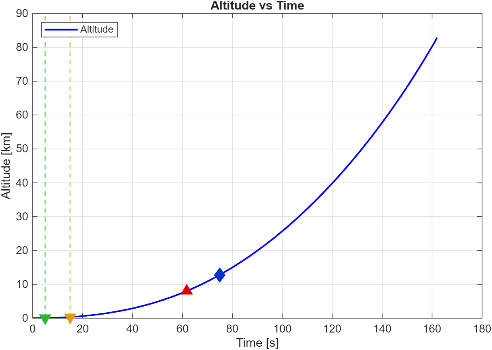
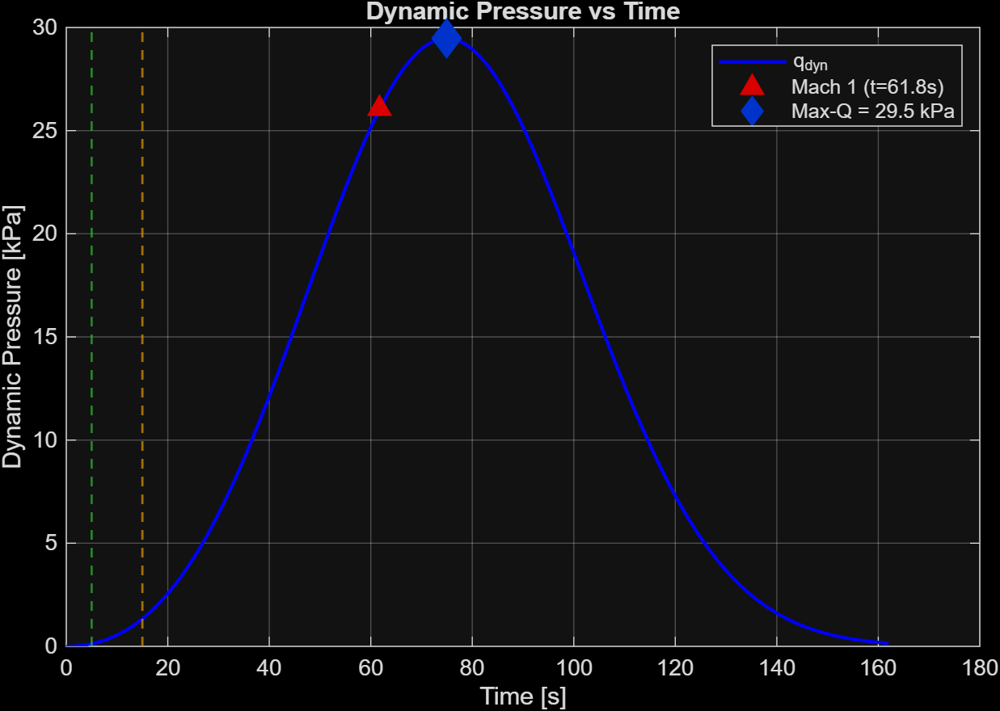
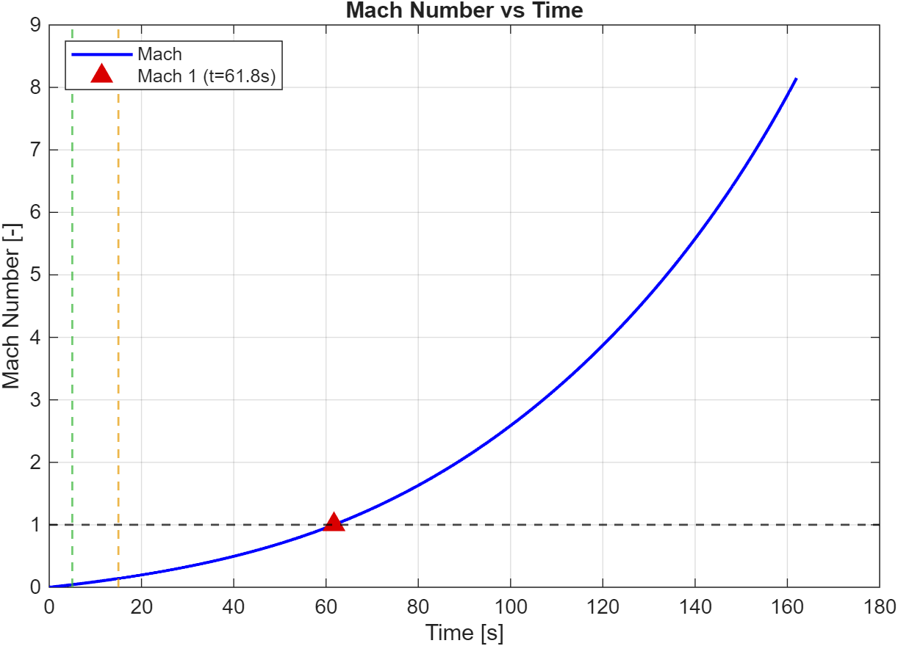
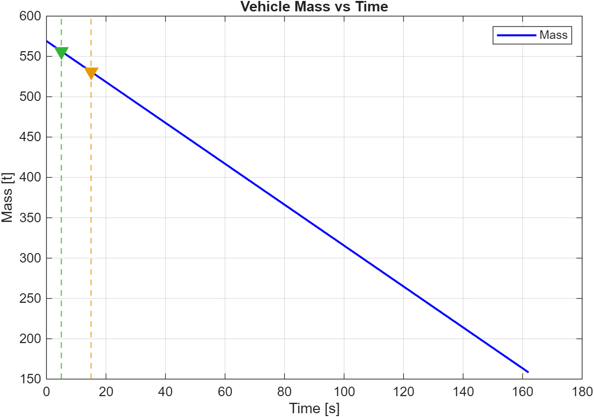
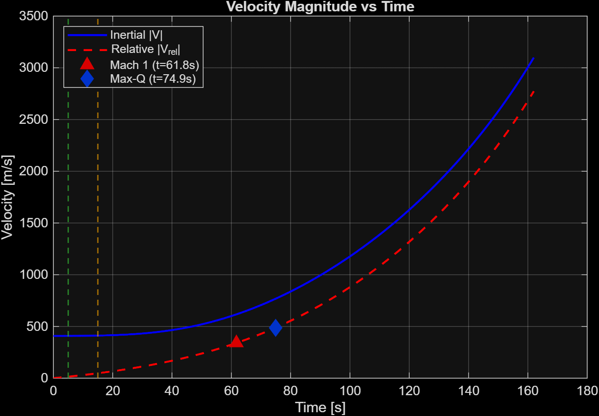
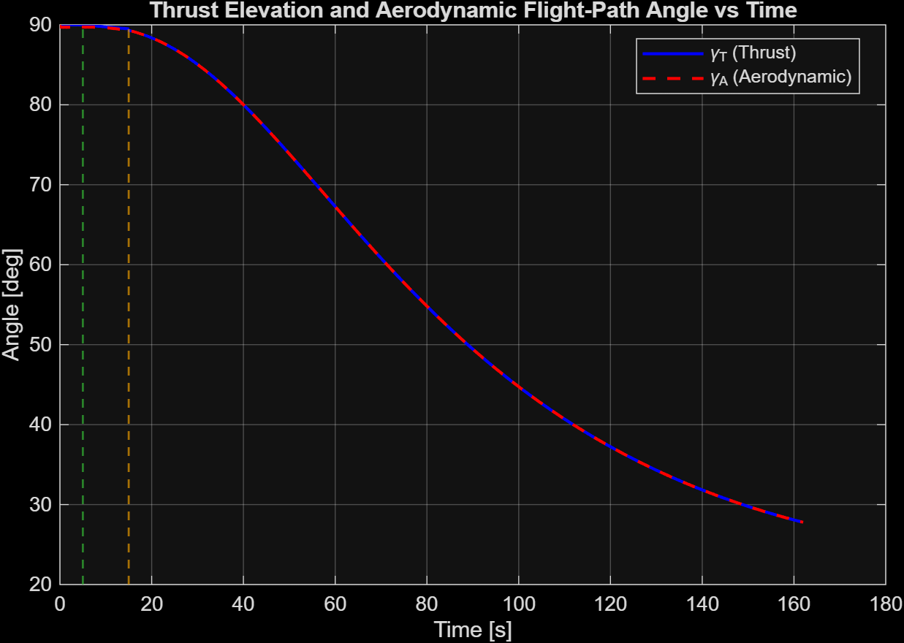
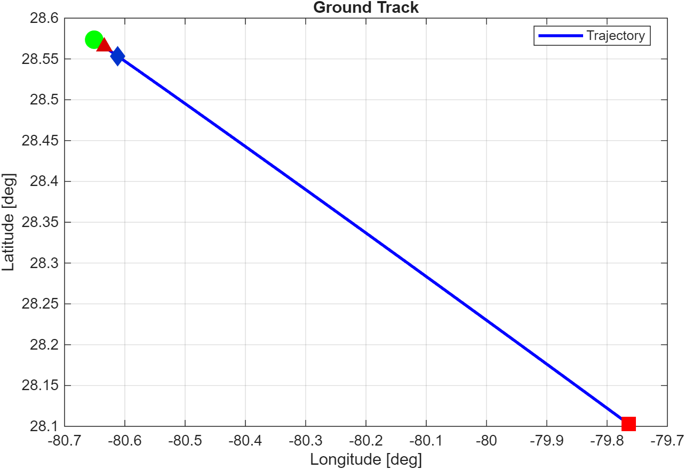

# HM0 — Falcon 9 First Stage Ascent Simulation

3-DoF point-mass simulation of the Falcon 9 first-stage powered ascent from
the Kennedy Space Center, integrating the spherical-coordinate equations of
motion with thrust, gravity, and aerodynamic drag through three flight phases
(vertical lift-off, programmed pitchover, zero-lift gravity turn).

## Problem statement

Reproduce the powered-ascent trajectory of the Falcon 9 first stage
(launch from KSC, lat 28.57°N) under a simplified set of assumptions:

- **Vehicle:** rigid point mass; vacuum thrust corrected for ambient
  back-pressure (`T = T_vac − p_atm · A_ex`); constant mass-flow rate;
  representative aggregate mass at lift-off ≈ 569 t.
- **Earth model:** spherical, rotating; Keplerian (1/r²) gravity.
- **Atmosphere:** isothermal exponential (`ρ = ρ₀·exp(−h/H)`, `H = 8 km`);
  drag-only aerodynamics with constant `C_D = 0.329`.
- **Frames:** state in spherical coordinates `(r, θ, φ)`; inertial velocity
  resolved in the local Up-East-North (UEN) frame `V = [u, v, w]`.
- **Mission programming:**
  | Phase | Duration | Thrust direction                                |
  |:------|:--------:|:------------------------------------------------|
  | Vertical ascent | 0–5 s | radial (Up)                                |
  | Pitchover | 5–15 s | thrust elevation linear from 90° to 89.5°     |
  | Gravity turn | 15 s → MECO | thrust aligned with relative velocity   |

Produce time histories of altitude, velocity, mass, dynamic pressure, Mach
number, thrust/aerodynamic angles, ground track and 3D trajectory; mark
the key mission events (Mach 1, max-Q, end of each phase).

## Approach

- **Integrator:** `ode45` with tight tolerances
  (`RelTol = 1e-10`, `AbsTol = 1e-12`, `MaxStep = 1 s`) over `[0, t_b]` with
  `t_b = 162 s` (first-stage burn time).
- **Equations of motion** in `(r, θ, φ, u, v, w, m)` derived from rotating-frame
  kinematics with explicit transport terms (`v²+w²)/r`, etc.). See the local
  function `eom` at the bottom of [main.m](main.m).
- **Phase logic** is encoded directly in `eom`: thrust direction switches at
  `t = 5 s` (end vertical) and `t = 15 s` (end pitchover) without integrator
  events, since the timings are deterministic.
- **Post-processing** computes Mach, dynamic pressure, thrust elevation /
  aerodynamic flight-path angle, and re-projects the ECI trajectory into the
  launch-site ENU frame for the 3D plot.

## How to run

From this folder:
```matlab
main
```

Headless:
```bash
matlab -batch "run('main.m')"
```

The script regenerates the eight figures in [`figures/`](figures/) and prints a
console summary with mission-event timing.

## Results

Console highlights (nominal run):

```
Initial mass:           569100 kg
Final mass:             158257 kg          (Δm = 410.8 t propellant burnt)
Final altitude:         82.84 km
Final relative velocity: 2773.6 m/s
Final Mach:             8.15
Mach 1:    t = 61.8 s     h = 8.04 km
Max-Q:     t = 74.9 s     h = 12.78 km     q = 29.5 kPa
```

| 3D trajectory (local ENU) | Altitude vs time |
|:-:|:-:|
|  |  |

| Dynamic pressure (max-Q ≈ 29.5 kPa @ 75 s) | Mach number |
|:-:|:-:|
|  |  |

| Mass | Velocity (inertial vs relative) |
|:-:|:-:|
|  |  |

| Thrust & aero flight-path angles | Ground track |
|:-:|:-:|
|  |  |

The simulation reproduces the physically expected pattern:
trans-sonic crossing slightly **before** max-Q (drag scales as `ρ·V²` and
density drop wins over velocity rise after ~75 s); ground track curves
slightly eastward as the gravity-turn aligns thrust with the
Earth-rotation-augmented relative velocity.

## Files

| File | Role |
|------|------|
| [`main.m`](main.m) | End-to-end driver: constants, IC, ODE integration, post-processing, figures |
| [`main2.m`](main2.m) | Non-dimensional variant, cross-validated against `main.m` by the test suite — see note below |
| [`figures/`](figures/) | PNGs regenerated on every run of `main.m` |
| `documentazione.txt` | Italian working notes for `main2.m` (kept as private context, not the entry-point doc) |

### Note on the non-dimensional variant (`main2.m`)

`main2.m` re-solves the same problem with all variables non-dimensionalized
against the reference scales

| Quantity     | Reference                      | Value           |
|--------------|--------------------------------|-----------------|
| length `L*`  | Earth radius `R_E`             | 6 378 137 m     |
| velocity `V*`| 1st cosmic velocity            | 7800 m/s        |
| time `T*`    | `L* / V*`                      | ≈ 817.7 s       |
| mass `m*`    | initial mass `m_0`             | 569 100 kg      |

so that `R_E* = 1` and the dimensionless dynamics carry only ratios such as
`g·T*/V*`. The motivation is twofold: (i) make every term `O(1)` for better
numerical conditioning, (ii) make the formulation independent of unit
conventions. This variant is kept for the optimization homework that follows;
the dimensional `main.m` remains the canonical entry-point for HM0.
