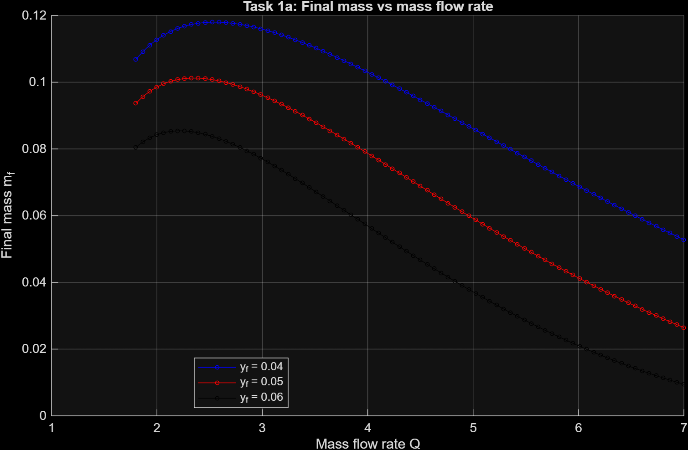
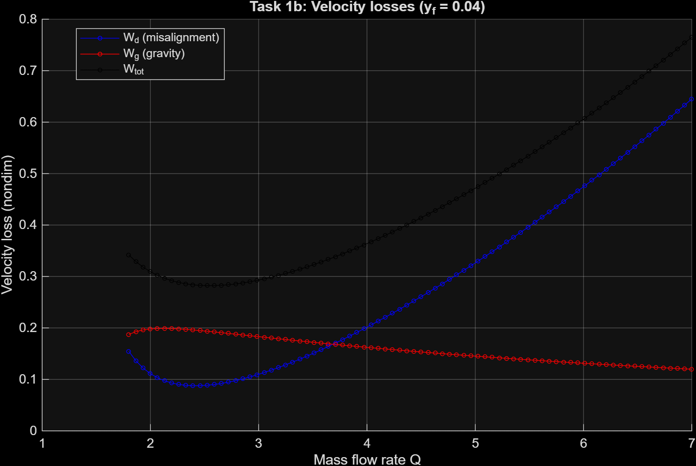
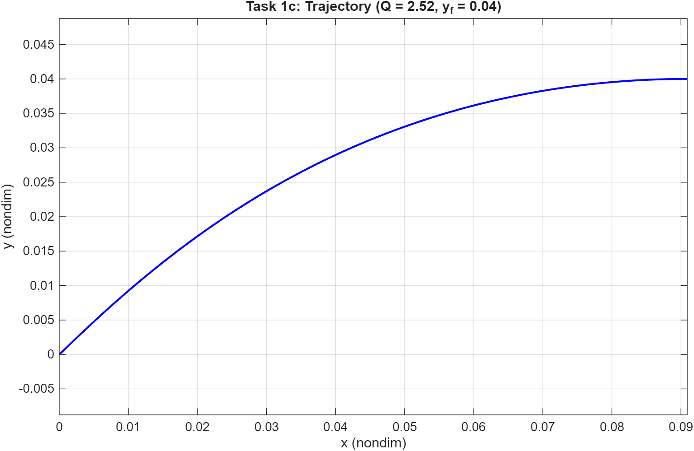
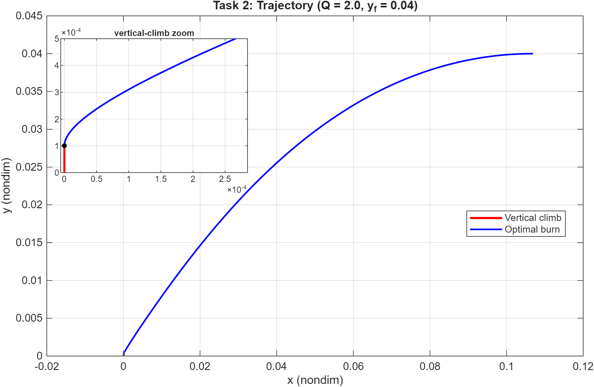
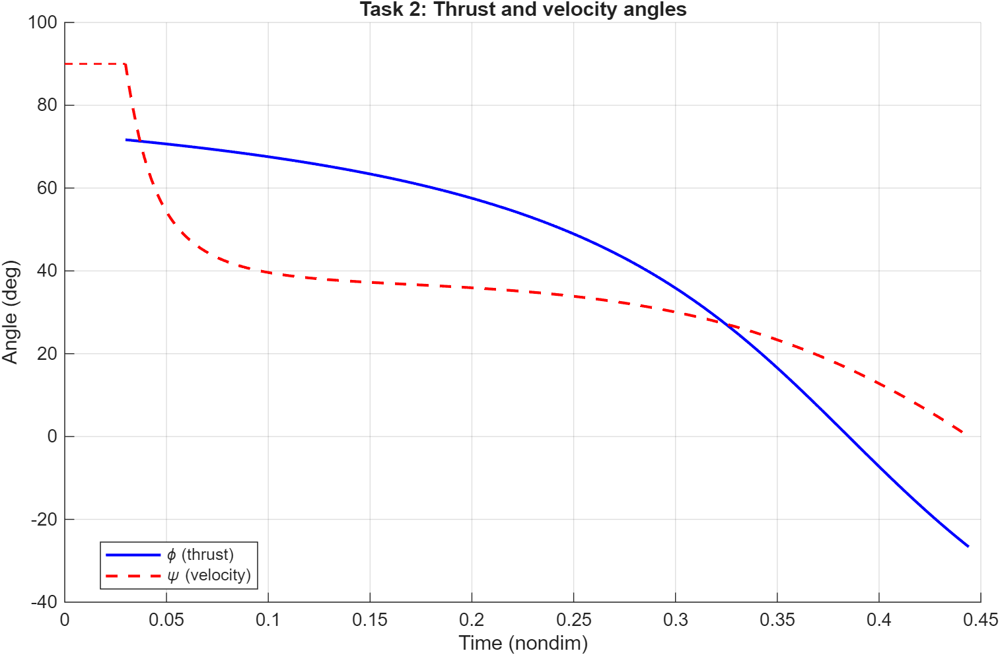
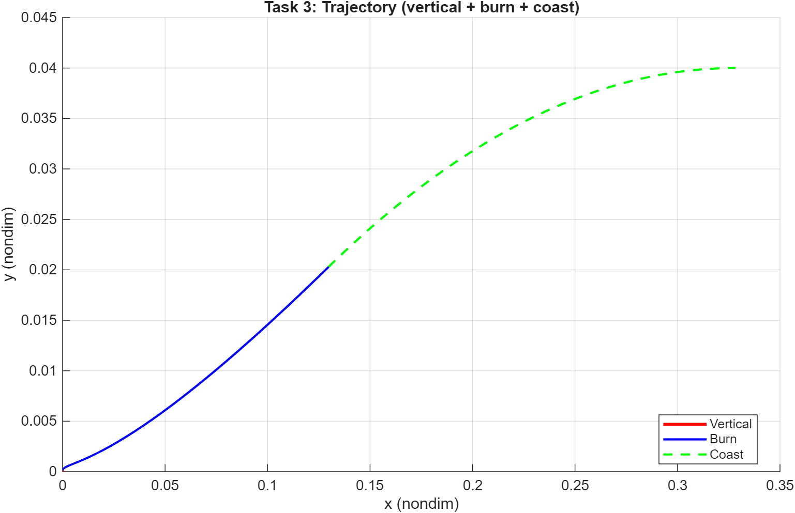
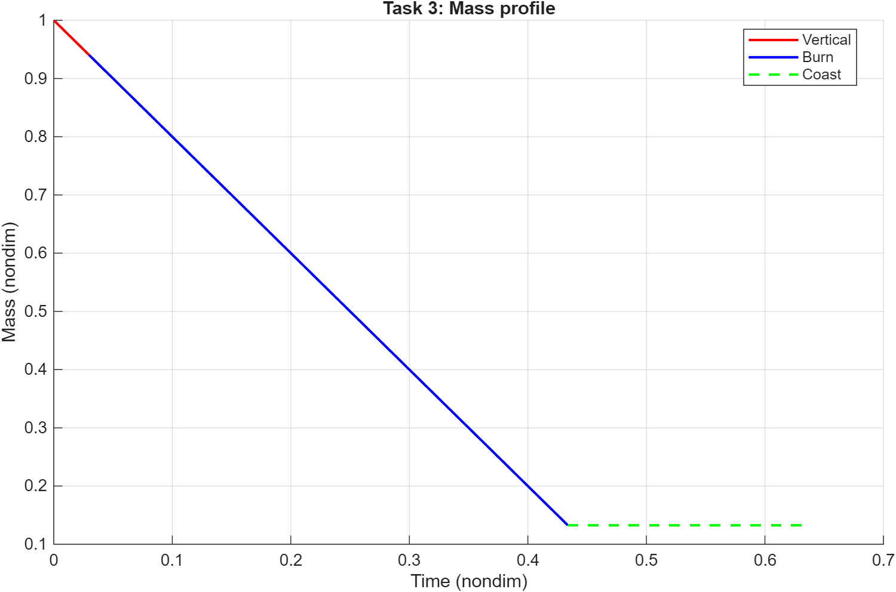
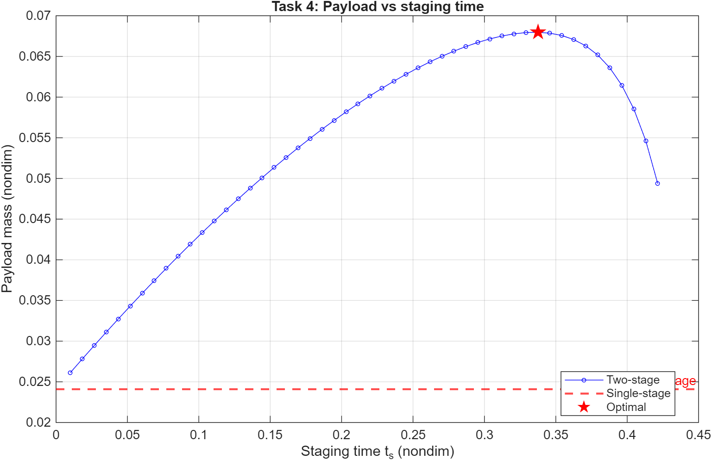
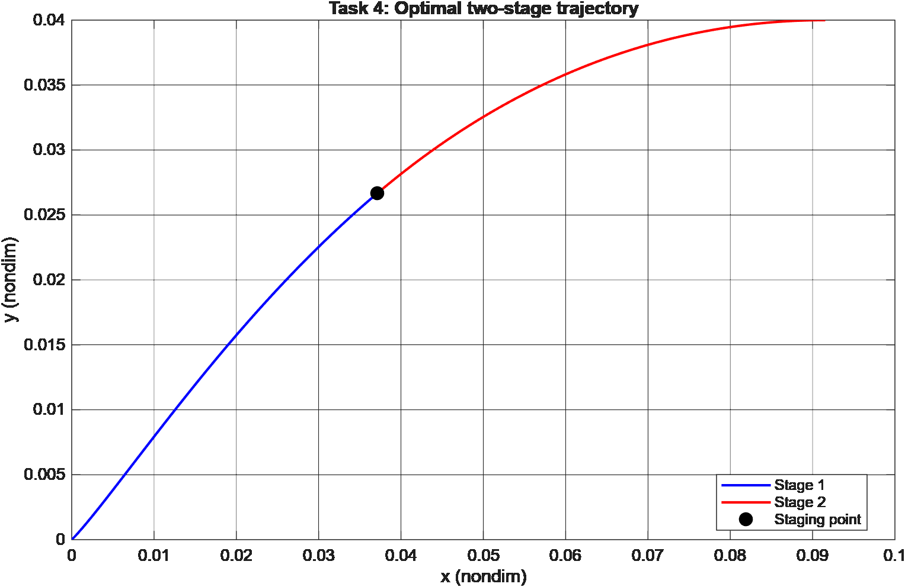
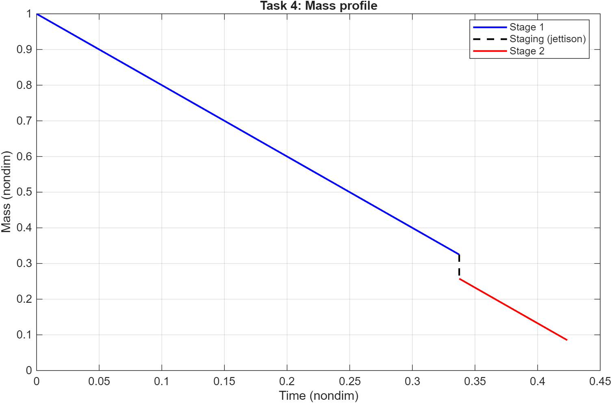

# HM1 — Indirect Optimization of an Ascent Trajectory

Indirect (Pontryagin-based) optimization of a 2D, flat-Earth, drag-free
ascent. Four progressively richer mission programs, each solved by reducing
the optimal-control problem to a multi-point Boundary Value Problem and
shooting it with `fsolve` over the costate initial conditions and the
free-time variables.

## Problem statement

Five-state planar dynamics with thrust direction `φ` as the only control:

$$
\dot x = v_x,\quad \dot y = v_y,\quad
\dot v_x = \tfrac{T}{m}\cos\varphi,\quad
\dot v_y = \tfrac{T}{m}\sin\varphi - g,\quad
\dot m = -\tfrac{T}{c}.
$$

Everything is non-dimensionalized with `g = 9.81 m/s²`, `V_ref = 7.8 km/s`,
`m_ref = m₀ = 10⁶ kg` (so `L_ref ≈ 6200 km`, `t_ref ≈ 795 s`). Fixed data:
`c = 0.6`, structural coefficient `η = m_s/m_p = 0.1`. Terminal conditions
in nondim units: `v_x(t_f) = 1`, `v_y(t_f) = 0`, target altitude `y_f`.

The cost is **maximum final mass** (≡ minimum fuel ≡ maximum payload after
applying the structural-coefficient model). The four tasks differ in mission
sequence:

| Task | Sequence                       | Shooting unknowns                               |
|------|--------------------------------|-------------------------------------------------|
| 1    | single burn arc                | `λ_vx0, λ_vy0, λ_y, t_f` (with `λ_m0 ≡ 1`)      |
| 2    | vertical climb → burn          | same 4, integrated from the post-climb state    |
| 3    | vertical climb → burn → coast  | `+ λ_m0` and burn duration; switching at cutoff |
| 4    | burn → staging → burn (no climb)| same 4; staging time `t_s` swept in an outer loop |

## Approach

- **Necessary conditions:** Euler-Lagrange / Pontryagin with linear costate
  evolution (control-affine system → bilinear-tangent law for `φ`); the free
  terminal time gives the Hamiltonian-vanishing condition `H = 0`.
- **Numerical refinements (course-notes "migliorie"):** the costates are
  normalized by fixing `λ_m0 = 1` (`H` is homogeneous of degree 1 in `λ`), and
  `H = 0` is imposed at the *initial* instant, where with `v_x = v_y = 0` it is
  algebraic — `H(0) = −λ_vy0 + T(|λ_v0| − 1/c)`. Each move removes one
  unknown/condition, leaving a **4-unknown** shooting in which `λ_m` never
  enters the residual (Tasks 1, 2, 4). Task 3 keeps `λ_m0` for the coast switch.
- **Single shooting:** for a trial of the unknowns the state `[x,y,v_x,v_y,m]`
  is integrated forward with `ode45`, and `fsolve` drives the four residuals
  (terminal `y, v_x, v_y` and `H(0) = 0`) to zero.
- **Continuation strategy** — central to making the shooting converge across
  the parameter sweeps in Task 1: solve at a friendly `Q` (T/W ratio ≈ 1.8),
  then warm-start each neighboring `Q` from the previous solution. Sweep
  forward and backward from the initial point.
- **Coast-arc handling (Task 3):** at engine cutoff the switching function
  `S = |λ_v|/m − λ_m/c` must vanish (with `λ_m = 1` at cutoff); during coast
  `λ_m` is constant and `λ_vy` ramps linearly, so a closed-form ballistic match
  is used instead of re-integrating. A short-burn initial guess selects the
  physical (`v_y > 0`) root over a spurious one.
- **Staging (Task 4):** the structural mass jettisoned at `t_s` is
  `m_s = η·Q·t_s`; total payload is `m_f·(1+η) − η`. Outer loop sweeps `t_s`
  and the inner BVP returns the corresponding final mass.

Tight tolerances throughout (`ode45`: `RelTol = 1e-10`, `AbsTol = 1e-12`;
`fsolve`: `1e-10` on both function and step).

## How to run

From this folder:
```matlab
main_task1     % parameter sweeps, ~20 s
main_task2     % single solve, ~5 s
main_task3     % single solve with coast, ~5 s
main_task4     % staging-time sweep, ~30 s
```

Headless (regenerates everything in `figures/`):
```bash
matlab -batch "for k=1:4, run(sprintf('main_task%d.m', k)); close all; end"
```

Each script writes its plots into `figures/` with a `task<N>_` prefix.

## Results

### Task 1 — Optimal mass-flow rate

For three target altitudes `y_f ∈ {0.04, 0.05, 0.06}` the final mass exhibits
a clear interior maximum in `Q`: too low ⇒ gravity losses dominate,
too high ⇒ short burn at very high T/W wastes Δv on overshooting the optimal
flight-path angle. The optimal rates are `Q* = 2.52, 2.33, 2.19` respectively
(the assignment's nominal `Q = 2` sits just below them), and the single-stage
payload turns negative at `y_f = 0.06` — a single stage cannot reach that orbit.



| Velocity-loss decomposition (`y_f = 0.04`) | Optimal trajectory at `Q*` |
|:-:|:-:|
|  |  |

### Task 2 — Adding a vertical climb

A short vertical climb to `y₁ = 10⁻⁴` (≈ 620 m dimensional) is prepended.
The vertical-climb segment trades a small payload penalty for realism /
launch-base safety considerations.

| Trajectory | Thrust & velocity angles |
|:-:|:-:|
|  |  |

### Task 3 — Adding a coast arc

Cutting the engine before injection saves propellant if the residual ballistic
arc lands the vehicle at the correct injection state. The BVP grows by one
unknown (the burn duration prior to coast) and one switching condition.

| Trajectory (vertical → burn → coast) | Mass profile |
|:-:|:-:|
|  |  |

### Task 4 — Optimal staging

A single staging event is allowed, jettisoning the structural mass
`m_s = η·Q·t_s` at `t = t_s`. Sweeping `t_s` and re-solving the inner BVP
shows a sizeable payload gain over the single-stage baseline:



| Optimal two-stage trajectory | Mass profile (with jettison step) |
|:-:|:-:|
|  |  |

Numerical takeaway from one converged run with `Q = 2`, `y_f = 0.04`:

```
Single-stage payload:   0.0241
Two-stage  payload:     0.0680   (optimal staging at ts = 0.337)
Payload gain:          +182%
```

The very large relative gain reflects the simplifications of the model
(constant `Q` across stages, no atmospheric losses, identical `Isp`). Real
launchers see much smaller — but still substantial — gains from staging.

## Files

| File | Role |
|------|------|
| [`main_task1.m`](main_task1.m) | Single-arc indirect solution; parameter sweep over `Q` and `y_f`; loss decomposition |
| [`main_task2.m`](main_task2.m) | Vertical climb + optimal burn arc |
| [`main_task3.m`](main_task3.m) | Vertical climb + burn + coast arc |
| [`main_task4.m`](main_task4.m) | Two-stage optimization sweeping the staging time |
| [`ode_burn.m`](ode_burn.m) | Common state + costate ODE shared by all tasks |
| [`figures/`](figures/) | PNGs regenerated on each `main_taskN` run |
