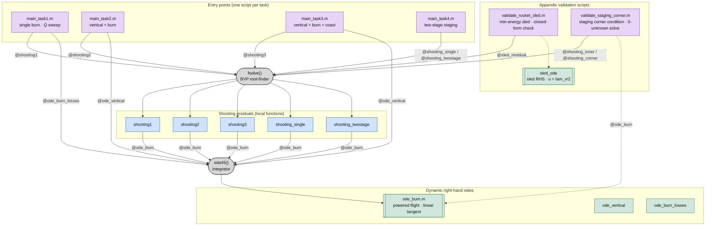
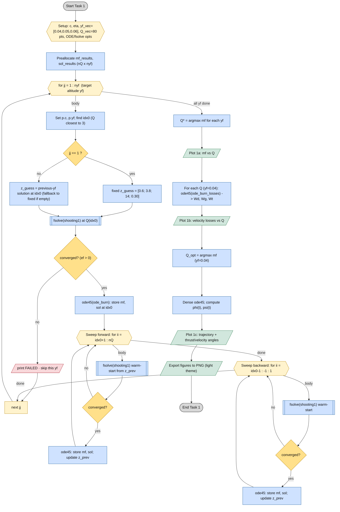
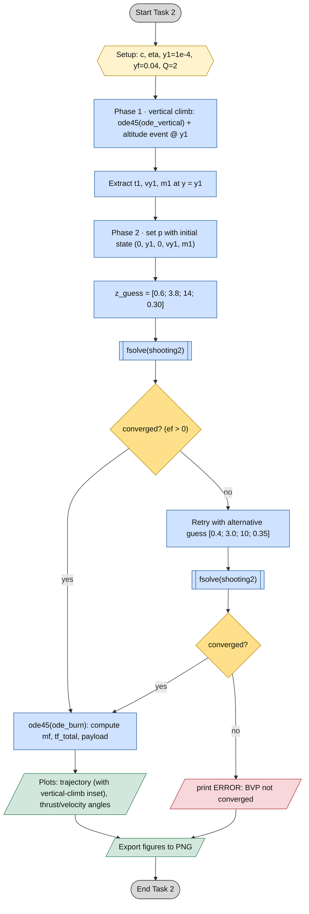
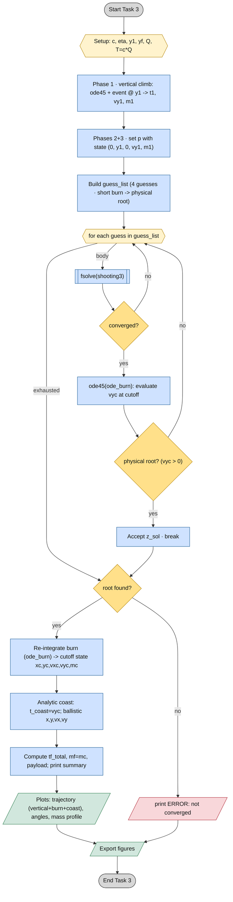
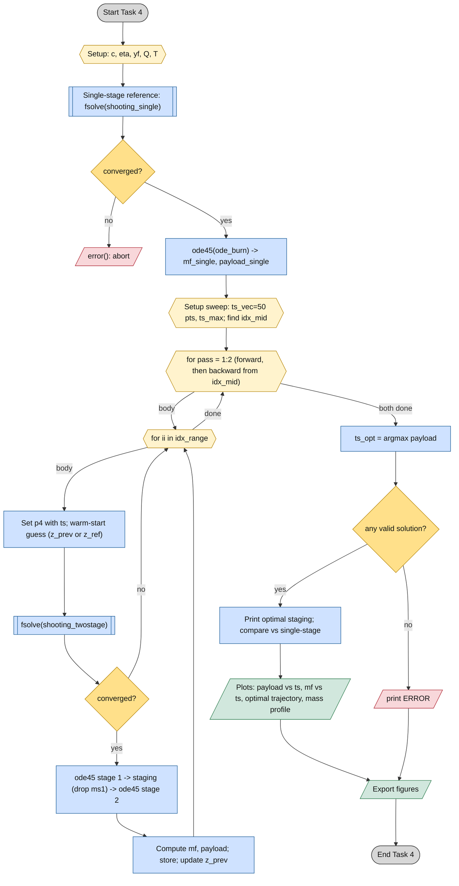
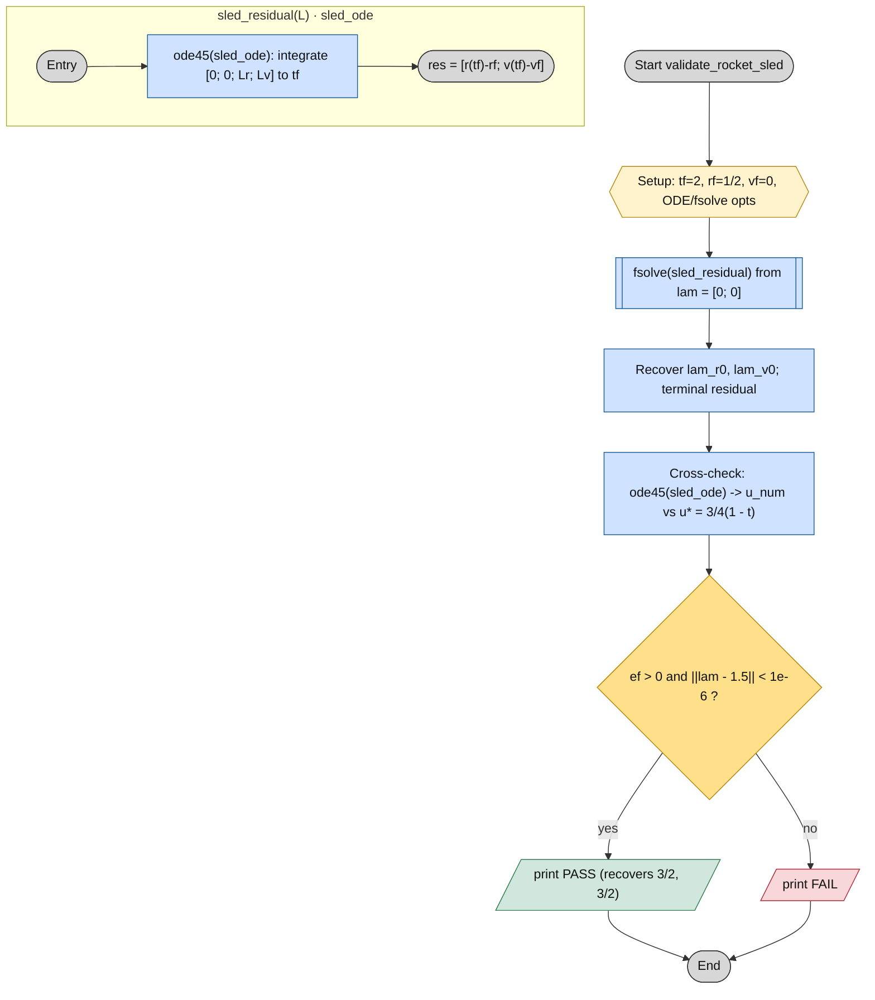
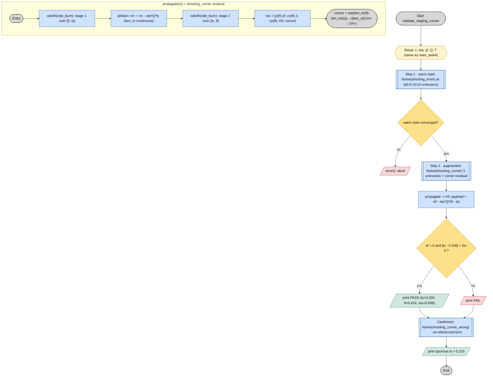

# HM1 — Control-Flow Diagrams (ISO 5807)

Detailed, color-coded step-by-step flowcharts of the four entry-point scripts,
the two Appendix validation scripts, and the shared routines in this folder,
obtained by static reading of the source. Symbols follow **ISO 5807** (terminator, process, predefined process,
decision, preparation, data I/O) and are mapped onto Mermaid node shapes —
and colored by category — so the diagrams render natively on GitHub.

## Symbol & color legend

| ISO 5807 symbol | Meaning | Mermaid node | Color |
|---|---|---|---|
| Terminator (stadium) | Start / End | `([ ... ])` | grey |
| Preparation (hexagon) | Setup / loop init | `{{ ... }}` | amber |
| Process / predefined | Operation / solver call | `[ ... ]` · `[[ ... ]]` | blue |
| Decision (rhombus) | Conditional branch | `{ ... }` | yellow |
| Data I/O (parallelogram) | print / figure / export | `[/ ... /]` | green |
| — | Error / abort path | — | red |

---

## 0 · Code architecture (call graph)

How the four entry points sit on the two numerical engines (`fsolve`, `ode45`)
and the dynamic right-hand sides.



---

## 1 · Task 1 — Single burn arc, Q sweep with continuation

Bidirectional sweep (forward/backward) starting from `Q ≈ 3` with warm-start of
the previous solution; post-processing into three plots.



---

## 2 · Task 2 — Vertical climb + optimal burn arc

Phase 1 with an altitude event; Phase 2 BVP with a fallback guess if the first
solve fails.



---

## 3 · Task 3 — Vertical + burn + coast (physical-root search)

The four guesses are scanned, accepting the first root with `vyc > 0` (physical
ballistic coast); the coast phase is analytic.



---

## 4 · Task 4 — Optimal staging (two stages)

Single-stage reference, then a bidirectional sweep of the staging time `ts`
outward from the middle of the range.



---

## 5 · Shared subroutines

Left: the dynamic RHS (`ode_burn`, linear-tangent steering). Right: the common
pattern of every shooting residual — a guard on `tf`, a `try/catch` around the
integration, and the free-time condition `H = 0` imposed algebraically at the
initial instant.

```mermaid
flowchart TD
  subgraph A["ode_burn(t, z, p)"]
    ob([Entry]):::term --> unpack["Unpack vx, vy, m from z"]:::proc
    unpack --> cost["Costates: lam_vx=const; lam_vy=lam_vy0 - lam_y*t; |lam_v|"]:::proc
    cost --> phi["Optimal angle phi = atan2(lam_vy, lam_vx)"]:::proc
    phi --> deriv["dz = [vx; vy; (T/m)cos phi; (T/m)sin phi - 1; -Q; (T/m^2)|lam_v|]"]:::proc
    deriv --> ret([return dz]):::term
  end

  subgraph B["shooting*(z0, p) — common pattern"]
    sh([Entry: unknowns lam_v0, lam_y, (lam_m0), tf]):::term --> guard{"tf in valid range?"}:::decision
    guard -->|no| pen[/"res = 1e6 (penalty)"/]:::err --> rret
    guard -->|yes| pack["Pack costates into pp; ic with lam_m0=1"]:::proc
    pack --> tryint[["try: ode45(ode_burn) 0 -> tf -> zf"]]:::proc
    tryint --> caught{"integration ok?"}:::decision
    caught -->|no| pen
    caught -->|yes| h0["Compute H0 at t0 (free-time condition)"]:::proc
    h0 --> resid["res = [y(tf)-yf; vx(tf)-1; vy(tf); H0]"]:::proc
    resid --> rret([return res]):::term
  end

  classDef term fill:#d7d7d7,stroke:#333,color:#111
  classDef proc fill:#cfe2ff,stroke:#1c5d99,color:#111
  classDef decision fill:#ffe08a,stroke:#b8860b,color:#111
  classDef err fill:#f8d7da,stroke:#b02a37,color:#111
```

> **Note.** `shooting3` departs from the common pattern: 5 unknowns (`lam_m0`
> kept free) plus switching/coast conditions at cutoff instead of `H = 0` at
> `t0`. It is the only variant not reducible to the 4-unknown scheme above.

---

## 6 · Appendix validation scripts

Two standalone checks that back the appendix claims: `validate_rocket_sled.m`
(Appendix A) recovers a closed-form optimum, and `validate_staging_corner.m`
(Appendix C) reproduces the swept staging optimum of Task 4 and shows that
dropping the burnout reference misplaces it.




