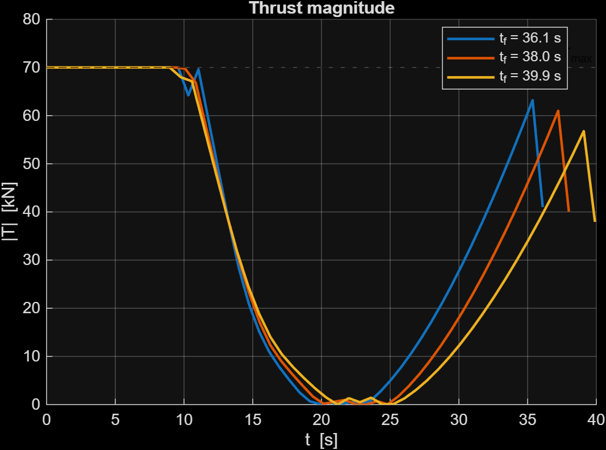
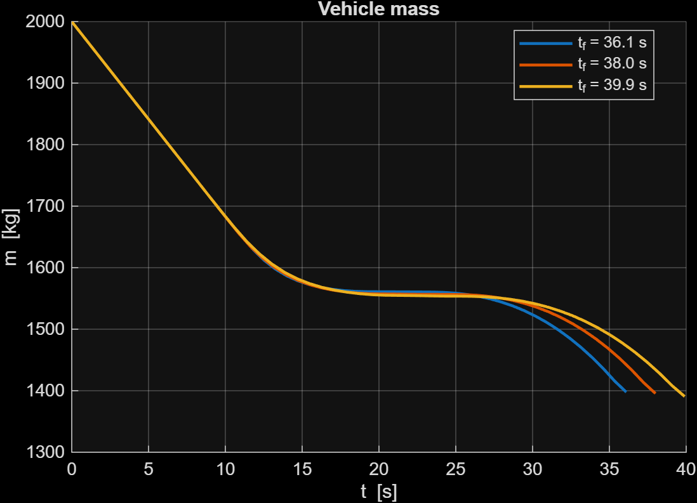
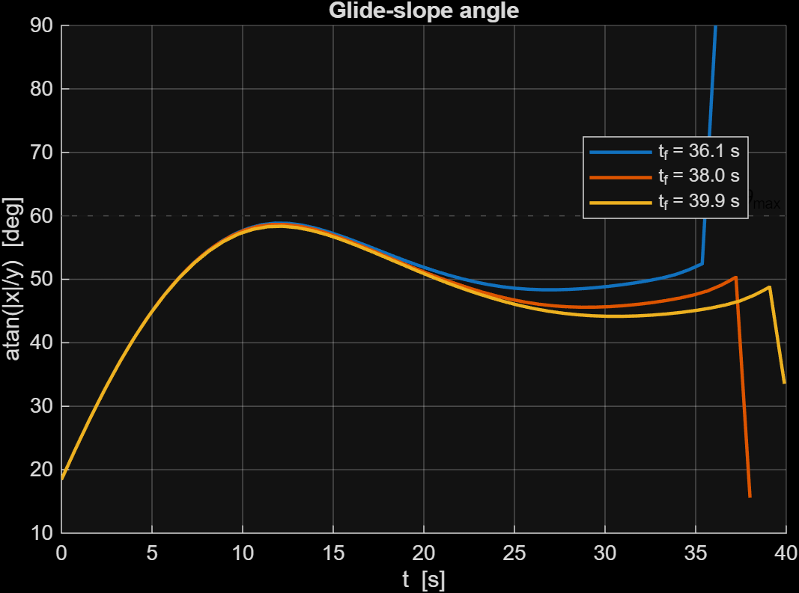

# HM2 — Powered Descent and Landing of Reusable Launch Vehicles

Direct-collocation solution to the minimum-fuel powered-descent problem for a
2D point-mass model (no aerodynamics, flat Earth). Ports the SpaceX-style
"divert-and-soft-land" planning problem to a small NLP solvable in MATLAB
without external dependencies.

> **Assignment:** see
> [`Homework 2 - Powered Descent Landing.pdf`](../DCLV_MATERIALE_CORSO_26042026/Homework%202%20-%20Powered%20Descent%20Landing.pdf)
> in the course material folder.

## Problem at a glance

| Quantity              | Value                          |
| --------------------- | ------------------------------ |
| Initial position      | (1000, 3000) m                 |
| Initial velocity      | (300, −200) m/s                |
| Initial mass          | 2000 kg                        |
| Final state           | (0, 0, 0, 0) — pinpoint, soft  |
| Flight time `tf`      | 38 s (fixed)                   |
| Thrust bounds         | 0 ≤ |T| ≤ 70 kN                |
| Glide-slope half-angle| 60°                            |
| `Isp`                 | 225 s                          |

Cost: **minimize fuel** ≡ maximize `m(tf)`.

## Approach

- **Transcription:** trapezoidal direct collocation on `N = 50` evenly spaced
  nodes. Decision vector stacks `[x, y, vx, vy, m, Tx, Ty]` per node.
- **Solver:** `fmincon` with the SQP algorithm. No external optimization
  toolbox required (CasADi / YALMIP not used at this stage — see roadmap).
- **Initial guess:** linear interpolation between the boundary states for the
  state variables; constant hover thrust `(0, m₀·g)` for the controls.
- **Glide-slope constraint** rewritten as the linear pair
  `±x − tan(θmax)·y ≤ 0`, which is convex.
- **Sensitivity sweep:** the script re-solves the problem for `tf ∈ {0.95, 1.00, 1.05} · 38 s`
  and overlays the three solutions on the same plots.

## How to run

From this folder:

```matlab
main_task1
```

Or headless:

```bash
matlab -batch "run('main_task1.m')"
```

Expected runtime: ~30 s per `tf` value on a modern laptop (three runs total).

## Files

| File              | Role                                                 |
| ----------------- | ---------------------------------------------------- |
| `main_task1.m`    | Top-level script: data, sensitivity sweep, plots.    |
|                   | `solve_trapcol` — builds and solves the NLP.         |
|                   | `trap_nonlcon` — defects + thrust bounds + glide-slope. |
|                   | `dyn_rhs` — continuous dynamics (Eq. 2-6 of PDF).    |
|                   | `plot_results` — trajectory, thrust, mass, glide-slope plots. |

## Results (preliminary)

| `tf` [s] | `m_f` [kg] | fuel [kg] |
| -------- | ---------- | --------- |
| 36.10    | 1397.8     | 602.2     |
| 38.00    | 1395.5     | 604.5     |
| 39.90    | 1390.6     | 609.4     |

Fuel consumption grows monotonically with `tf` over the swept window
(longer hover ⇒ more gravity losses). All three solutions respect the
glide-slope corridor and the thrust-magnitude bounds.

| Trajectory (3 sensitivity runs + glide-slope corridor) | Thrust magnitude |
|:-:|:-:|
|  |  |

| Mass | Glide-slope angle |
|:-:|:-:|
|  |  |

## Roadmap / TODO

- [ ] **Tighten convergence.** With the current settings (`MaxIterations = 500`,
      `'sqp'`) one of the three sensitivity runs hits the iteration cap with
      first-order optimality ≈ 5×10⁻⁴. Either raise the cap, supply analytical
      gradients, or warm-start from the nominal-`tf` solution.
- [ ] **Task 2 (optional, PDF Appendix A):** implement a Zero-Order Hold
      (ZOH) discretization. Solve over the same horizon and validate by
      forward-integrating the optimized control schedule with `ode45`.
- [ ] **Successive Convexification (SCvx).** Re-solve via convex
      sub-problems (YALMIP + a conic solver). The reference example
      `cvx_sled_class_2026.m` from the professor is the starting template.
- [ ] **Free-time variant.** Lift the `tf`-fixed assumption and minimize fuel
      over a variable horizon — likely the right framing for a real GFOLD-like
      formulation.
