# HM2 — Control-Flow Diagrams (ISO 5807)

Detailed, color-coded step-by-step flowcharts of the two entry-point scripts
(Task 1 trapezoidal collocation, Task 2 ZOH transcriptions) and every shared
routine in this folder, obtained by static reading of the source. Symbols
follow **ISO 5807** (terminator, process, predefined process, decision,
preparation, data I/O) and are mapped onto Mermaid node shapes — and colored by
category — so the diagrams render natively on GitHub.

Task 2 now assembles **five transcriptions** of the same fixed-time
minimum-fuel problem (one trapezoidal baseline plus ZOH variants **a–d**),
which share a non-dimensionalisation, boundary/path structure, and an
`ode45` fidelity replay, but differ in how they discretise the dynamics and in
which convex solver drives the inner step. The diagrams below trace each path
down to the constraint block, the discretisation kernel, and the trust-region
logic.

## Symbol & color legend

| ISO 5807 symbol | Meaning | Mermaid node | Color |
|---|---|---|---|
| Terminator (stadium) | Start / End / return | `([ ... ])` | grey |
| Preparation (hexagon) | Setup / loop init | `{{ ... }}` | amber |
| Process / predefined | Operation / solver call | `[ ... ]` · `[[ ... ]]` | blue |
| Decision (rhombus) | Conditional branch | `{ ... }` | yellow |
| Data I/O (parallelogram) | print / figure / export | `[/ ... /]` | green |
| — | Error / abort / warning path | — | red |

---

## Transcription roster (Task 2)

The five transcriptions and their defining choices — the decision vector,
how the dynamics enter the optimisation, what is held constant over a ZOH
interval, the solver, the warm start, and the `ode45` replay convention used
for the fidelity check.

| # | Name · local fn | Dynamics in the NLP/convex problem | Control hold | Inner solver | Warm start | Replay |
|---|---|---|---|---|---|---|
| — | **Trapezoidal** · `solve_trap` | trapezoidal defects (nonlinear equalities) | PWL thrust `T` | `fmincon` SQP | linear interp + hover | `pwl` |
| a | **Nonlinear ZOH + RK4** · `solve_zoh` | `x_{k+1} = RK4(x_k,u_k)` multiple-shooting defects (nonlinear eq) | ZOH thrust `T` | `fmincon` SQP | linear interp + hover, `u_N=0` | `zoh` |
| b | **LTV + SCvx** · `solve_scvx` | `x_{k+1}=Ā x + B̄ u + c̄` (linear eq, re-linearised each iter) | ZOH thrust `T` | `fmincon` SQP (inner) | trapezoidal baseline | `zoh` |
| c | **LTV + SCvx (YALMIP)** · `solve_scvx_yalmip` | same LTV linear eq; thrust bound as SOC | ZOH thrust `T` | ECOS SOCP (inner) | trapezoidal baseline | `zoh` |
| d | **GFOLD log-mass + SCvx** · `solve_gfold_scvx` | exact **LTI** (one matrix exp); only thrust upper bound linearised | ZOH accel `u=T/m` | ECOS SOCP (inner) | analytic max-thrust profile (self-start) | `u-zoh` |

Variants **c** and **d** are built only when both YALMIP and ECOS are on the
path; otherwise Task 2 runs the trapezoidal baseline plus variants **a** and
**b** and plots three curves instead of five.

---

## 0 · Code architecture (call graph)

How the two entry points sit on the numerical engines (`fmincon` for the NLP
paths, `YALMIP`+`ECOS` for the SOCP inner steps, `expm` for the LTI
discretisation, `ode45` for the augmented-ODE discretisation and every replay),
the per-transcription defect/path locals, and the two continuous right-hand
sides (`ode_descent`, `ode_descent_uacc`).

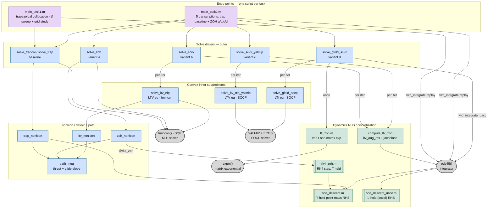

---

## 1 · Task 1 — Trapezoidal direct collocation, tf sensitivity sweep

Fixed-duration minimum-fuel NLP solved non-dim with `fmincon` (SQP); a
three-point sweep on flight time (`tf` nominal ±5%), per-solve diagnostics, then
a grid-convergence study replaying the PWL control through `ode45`. The NLP
assembly is factored into §1.1 and the post-solve diagnostics into §1.2.

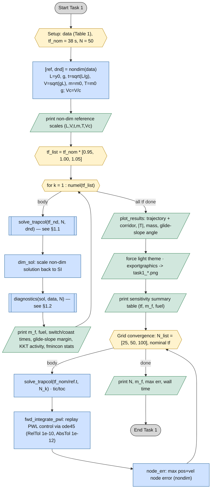

### 1.1 · NLP assembly (`solve_trapcol` / `solve_trap` / `solve_zoh`)

The three fmincon-driven drivers share the same skeleton: decision vector
`z = [x;y;vx;vy;m;Tx;Ty]` stacked node-by-node (length `7N`, `idx(i)=(i-1)*7+(1:7)`),
a linear-interp state + hover-thrust initial guess, box bounds, a 9-row linear
equality block for the boundary conditions, the maximise-final-mass objective,
and a transcription-specific nonlinear-constraint handle. They differ only in
that constraint handle (and in whether the last node's control is pinned to
zero for the ZOH variants).

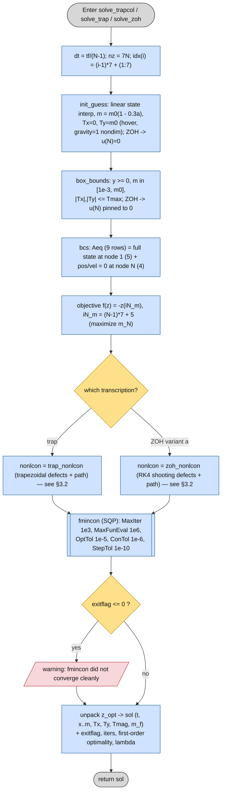

### 1.2 · Post-solve diagnostics (`diagnostics`)

Runs on the SI solution: burn/coast structure from `|T|` crossings, the
glide-slope margin, and KKT activity read from the `fmincon` inequality
multipliers.

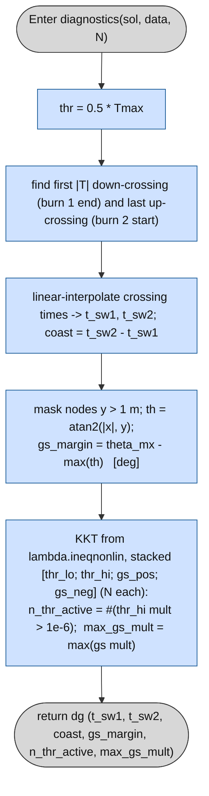

> **NLP structure recap.** Objective `-z(iN_m)` maximises final mass; the linear
> equality `Aeq` fixes the full state at node 1 and pos+vel = 0 at node N; box
> bounds enforce `y>=0`, `m` in `[1e-3, m0]`, `|Tx|,|Ty| <= Tmax`; the nonlinear
> constraints come from `trap_nonlcon` (collocation defects `= 0`, thrust +
> glide-slope path `<= 0`) or, for variant a, `zoh_nonlcon` (RK4 shooting
> defects `= 0`, same path block).

---

## 2 · Task 2 — Five ZOH transcriptions

Five transcriptions solved on the same grid and compared: the trapezoidal
baseline, then (a) nonlinear ZOH with RK4 multiple-shooting defects; (b)
LTV-linearised ZOH inside a successive-convexification (SCvx) outer loop with an
adaptive trust region (`fmincon` inner NLP); (c) the same SCvx loop with a
YALMIP/ECOS SOCP inner subproblem; (d) the GFOLD log-mass change of variables,
whose dynamics become exactly LTI so the discretisation is a single matrix
exponential and only the thrust upper bound is linearised (SOCP via
YALMIP/ECOS). Variants a–c warm-start from the trapezoidal baseline; variant d
self-starts. Variants c and d run only if YALMIP + ECOS are on the path.

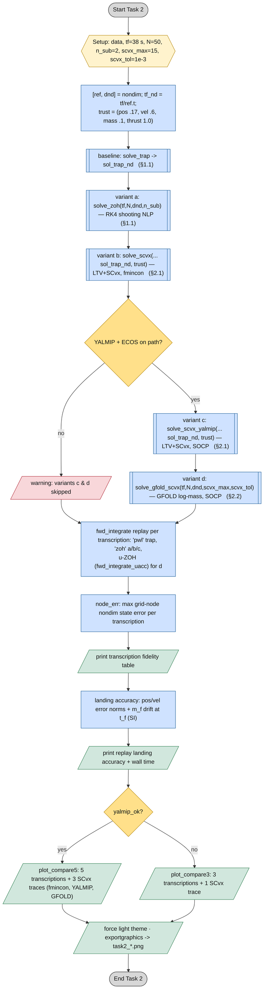

### 2.1 · SCvx outer loop (variants b and c)

Successive convexification with an adaptive trust region. `solve_scvx` uses an
`fmincon` inner NLP (LTV dynamics as linear equalities); `solve_scvx_yalmip` is
identical but solves an SOCP inner subproblem with YALMIP/ECOS. Each iteration
re-linearises about the current reference (`compute_ltv_zoh`, §3.3), solves the
convex subproblem inside the trust region, then validates the step against the
**nonlinear** dynamics by forward integration. The trust ratio
`eta = (actual m_f gain)/(predicted m_f gain)` drives accept/reject and
trust-region resizing.

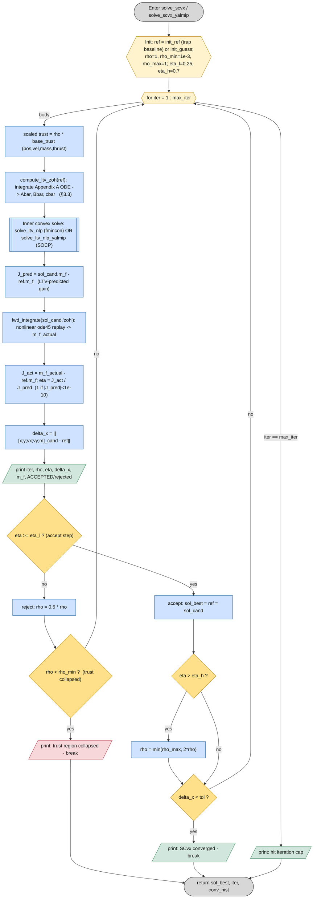

> **Inner LTV subproblem.** `solve_ltv_nlp` / `solve_ltv_nlp_yalmip` treat the
> discrete LTV dynamics `x_{k+1} = Abar_k x_k + Bbar_k u_k + cbar_k` as **linear
> equality constraints**, so `ltv_nonlcon` carries only the path constraints
> (`path_ineq`). The fmincon variant keeps the thrust bound as the nonlinear
> path inequality `|T| <= Tmax`; the YALMIP variant writes it as a second-order
> cone `norm(U_k) <= Tmax` and the glide-slope as linear inequalities. Box
> bounds are intersected with the per-variable trust region via `apply_trust`
> (fmincon) or inline trust inequalities (YALMIP).

### 2.2 · GFOLD log-mass SCvx loop (variant d)

The change of variables `z = ln(m)`, `u = T/m`, with slack `sigma >= ||u||`,
makes the translational dynamics **exactly LTI** (`ode_descent_uacc`), so the
Appendix A ZOH collapses to one matrix exponential (`lti_zoh`, §3.4) computed
**once** — no per-iteration re-linearisation of the dynamics and no singular
mass row. Only the thrust *upper* bound `sigma <= Tmax·e^{-z}` is nonconvex; it
is linearised about the current `z_ref` each iteration. The loop self-starts
from an analytic max-thrust mass profile (no trapezoidal warm start), leaves the
first solve free of the trust region, and validates each step with a
`u = T/m`-hold replay (`fwd_integrate_uacc`).

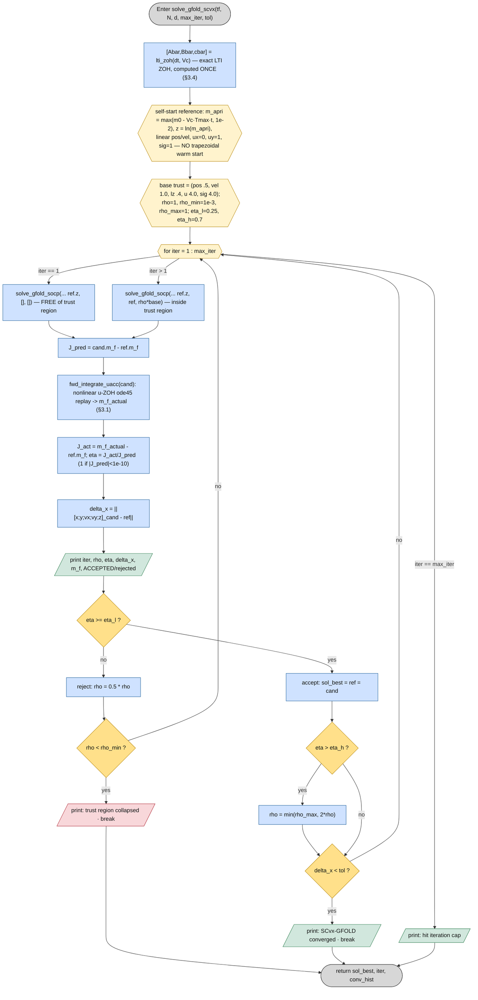

> **GFOLD inner SOCP (`solve_gfold_socp`).** State `XI = [x;y;vx;vy;z]`
> (`z = ln m`), control `W = [ux;uy;sigma]` (`u = T/m`). Constraints: initial
> condition `XI(:,1) = [x0;y0;vx0;vy0; z0=ln m0=0]` and terminal `XI(1:4,N)=0`
> (`z_N` free); LTI dynamics `XI_{k+1}=Abar·XI_k+Bbar·W_k+cbar` (equalities);
> the **lossless** cone `||u_k|| <= sigma_k` (exact SOC); the **linearised**
> upper thrust bound `sigma_k <= Tmax·e^{-z_ref}(1-(z_k - z_ref))` — the only
> nonconvexity; glide-slope cone (linear), `y>=0`, `z in [ln 1e-3, 0]`, and an
> optional trust box `(pos,vel,lz,u,sig)`. Objective `-XI(5,N)` maximises the
> terminal log-mass `z_N = ln(m_f)`. Recovered as `m = e^z`, `T = m·u`, with the
> last node's control padded to zero.

---

## 3 · Shared subroutines

The continuous right-hand sides, the RK4 propagator, the common defect/path
pattern, and the two discretisation kernels — all shared across Task 1, Task 2,
and the test suite.

### 3.1 · Continuous RHS (two ZOH conventions) + RK4

Two point-mass RHS files differ only in what is held constant over a ZOH
interval: `ode_descent` holds the **thrust vector** `T` (so acceleration
`T/m` grows as mass depletes), while `ode_descent_uacc` holds the
**acceleration** `u = T/m` (so `T = m(t)·u` floats). Both use gravity `= -1`
nondim. `rk4_zoh` is the fixed-step RK4 propagator used by the variant-a
shooting defects, holding `T` constant.

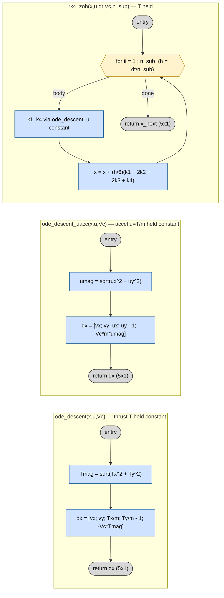

### 3.2 · nonlcon defect/path pattern

Every fmincon transcription reshapes `z` into the `7 x N` state/control grid,
forms the dynamics defects (equality `c_eq`), and appends the shared
`path_ineq` block (inequality `c_ineq`). The LTV inner NLP contributes no
defect (its dynamics are linear equalities in `Aeq`), so `c_eq = []`.

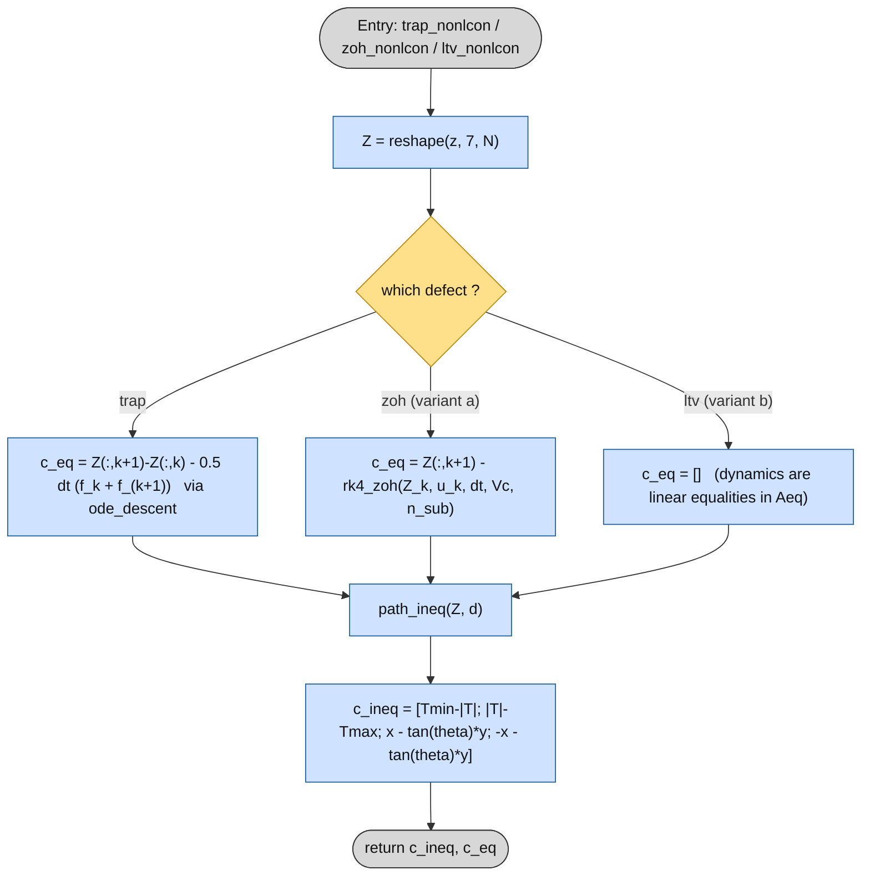

### 3.3 · LTV discretization (`compute_ltv_zoh`, Appendix A)

Used by the SCvx variants b and c. It does **not** use `rk4_zoh`: it integrates
the Appendix A augmented ODE (`ltv_aug_rhs`) over each interval with `ode45` in
the beta-gamma form, carrying the reference state, the transition matrix `Phi`,
the inverse transition `Psi = Phi^-1`, and the start-referenced integrals
`Beta = ∫ Psi·B` and `Gamma = ∫ Psi·c`. The Jacobians `df/dx`, `df/du`
(`jacobians`) feed the augmented RHS; `df/du` regularises `|T|` with a small
`1e-6` term to stay finite at `T = 0`.

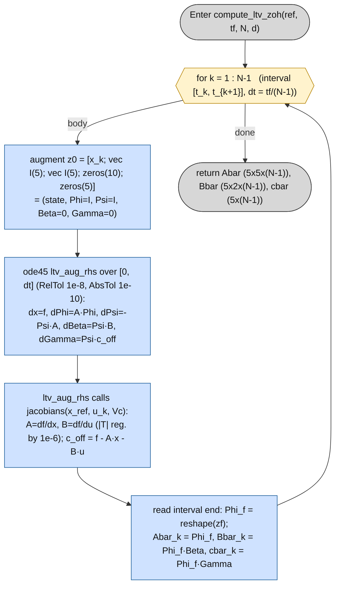

### 3.4 · LTI discretization (`lti_zoh`, GFOLD log-mass)

Used by variant d. Because `z = ln(m)`, `u = T/m` linearises the dynamics
*exactly*, the discretisation is a single van Loan block matrix exponential
computed **once** and reused for every interval (the system is time-invariant).
No per-interval integration, no singular mass row.

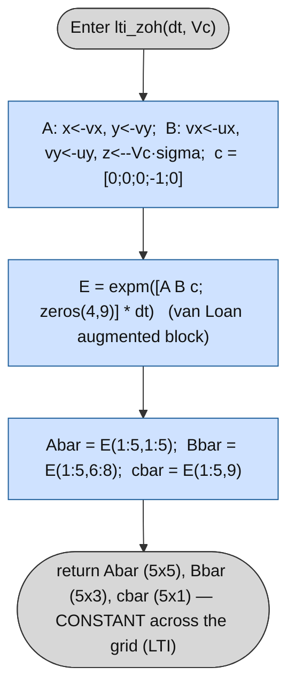

> **Why two discretisers.** The LTV path (§3.3) linearises the *nonlinear*
> thrust dynamics about a moving reference, so its matrices change every SCvx
> iteration and every interval, and are obtained by integrating the augmented
> STM ODE. The GFOLD path (§3.4) works in coordinates where the dynamics are
> already linear and time-invariant, so a single `expm` gives the exact ZOH
> matrices and the SCvx loop only has to chase the one linearised inequality
> (`sigma <= Tmax·e^{-z}`).
