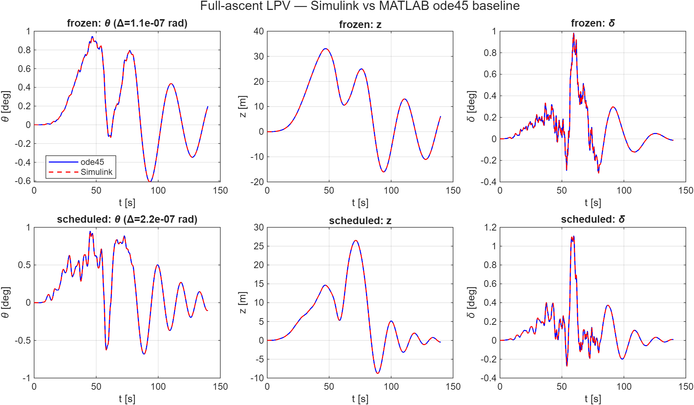
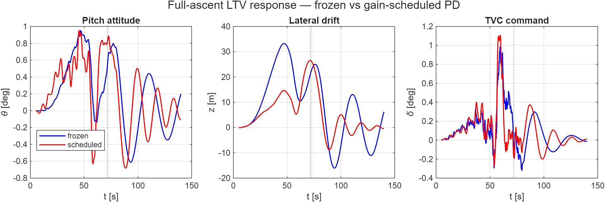
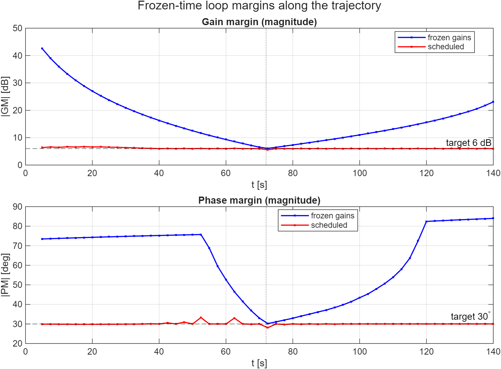
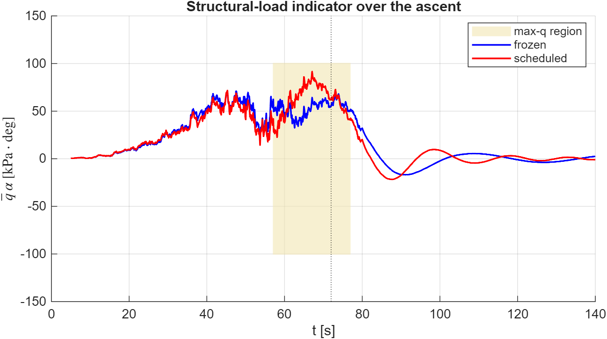

# HM3 — Beyond the assignment: full-ascent LPV attitude control

> **Portfolio showcase, not part of the HM3 deliverable.** The assignment asks
> for the **max-q̄** point design (`t = 72 s`); that frozen-time analysis lives
> in [`HM3/`](../) and is untouched. This folder extends it to the **whole
> ascent (0–140 s)** to demonstrate gain-scheduled launch-vehicle attitude
> control and a programmatically-built Simulink model. See ticket
> [`T007`](../../tickets/).

## Idea

HM3 freezes everything at max-q̄: the plant matrices of
[`build_plant_rigid`](../build_plant_rigid.m), the PD gains, the notch and the
TVC are all evaluated at `t = 72 s` and the closed loop is LTI. The professor's
wind generator (`General/hw3-v3/strong_wind.slx`), by contrast, spans the whole
ascent. HM3 reconciles them *upstream* — [`load_wind_profile`](../load_wind_profile.m)
windows 12 s of wind around max-q̄ — which is correct for a frozen-point model
but discards the rest of the trajectory.

Here the plant is made **time-varying** too, so wind generator and vehicle
dynamics share one clock and the generator is wired **directly into the loop**.
Everything needed already ships with the course data: `GreensiteLPV_DATA.mat`
holds the full time histories `A6(t), K1(t), a1(t), a3(t), a4(t), V(t)` (the
same dataset [`load_hw3_params`](../load_hw3_params.m) samples at a single
instant). The first bending mode and TVC are dropped — the showcase is the
**scheduling**, not the flex model.

## Model

The rigid pitch-plane plant of `build_plant_rigid` is written in time-varying
("LPV") form,

```
zddot     = a1*zdot + (a1*V + a4)*theta + a3*delta - a1*V*alpha_w
thetaddot = (A6/V)*zdot + A6*theta      + K1*delta - A6 *alpha_w
```

and realised in `hm3_full_ascent.slx` from **elementary blocks** — integrators
plus one **1-D lookup table** (on flight time) per coefficient — so every
coefficient stays inspectable, mirroring the style of the professor's own
generator. The generator `Subsystem` is **copied once** out of `strong_wind.slx`
(never modified) and drives the plant through `alpha_w = (v_wp + turbulence)/V(t)`.

Two controllers are compared on the same canvas, switched by the scalar `sched`:

| `sched` | controller | pitch gains |
|---------|------------|-------------|
| `0` | **frozen** | the single max-q̄ PD pair held over the whole flight |
| `1` | **scheduled** | `Kp_θ(t), Kd_θ(t)` from [`design_controller`](../design_controller.m) on a grid of frozen plants (continuation, every 5 s) |

The model is **authored from a script** ([`build_hm3_full_ascent.m`](build_hm3_full_ascent.m)),
not by hand: that file *is* the model definition, so it is fully reproducible
(contrast HM3's hand-built `hm3_closed_loop.slx`, see
[`models/SIMULINK_GUIDE.md`](../models/SIMULINK_GUIDE.md)).

## Results

The **MATLAB LTV ode45 integration is the source of truth**; the Simulink model
reproduces it. Driving the ode45 replay with the wind the model itself
generated, the two overlay to **≈1×10⁻⁷ rad on θ** (frozen 1.1e-7, scheduled
2.2e-7) — solver tolerance.



### Frozen vs gain-scheduled response

Both controllers keep the vehicle bounded through the sustained wind plateau
(peak `θ ≈ 0.95°`, consistent with HM3's windowed strong-wind case). The
schedule tightens the loop: lateral drift drops (peak `z` 33 → 27 m) and the
post-max-q oscillation is damped sooner.



### Frozen-time margin sweep — *why HM3 designs at max-q̄*

Freezing the plant at each instant and reading the loop margins is the punch
line. The **fixed max-q̄ gains** attain their *minimum* margin (the design
targets, 6 dB / 30°) **exactly at `t = 72 s`** and have more margin everywhere
else — because max-q̄ is the hardest, most aerodynamically-unstable instant
(`pole = +√A6` is largest there). The **schedule** holds 6 dB / 30° flat across
the flight.



So the honest finding is nuanced: a single max-q̄ design is already
**margin-adequate over the whole ascent** *because* it is sized at the binding
point — which quantitatively justifies HM3's point-design choice. Scheduling
does not buy worst-case stability here; it buys **uniform margins** and better
transient/drift behaviour.

### Structural load `q̄·α`

The load indicator `q̄(t)·α_total(t)` (`α_total = θ + ż/V + α_w`) peaks in the
max-q̄ region. The scheduled controller, holding attitude more tightly there,
actually rides a little *more* load near max-q̄ — the classic
attitude-hold vs load-relief trade, shown honestly rather than hidden.



> **Dynamic pressure.** This showcase uses the dataset's own `Q(t)` (peak
> ≈ 43.9 kPa at `t ≈ 67 s`). HM3's frozen `p.qbar ≈ 81 kPa` comes from a simple
> sea-level-referenced exponential atmosphere and is ≈ 2× larger at 15 km;
> `q̄·α` magnitudes here are scaled to the dataset value accordingly.

## Validation

`main_full_ascent.m` also checks that, frozen at `t_ref = 72 s`, the LPV loop
reproduces HM3's frozen-time response on the max-q̄ wind window:
`max|θ_LPV − θ_HM3| ≈ 7×10⁻¹⁰ rad` — the LPV model reduces exactly to the HM3
point design.

## How to run

```matlab
cd HM3/LTV_FULL_ASCENT
main_full_ascent          % LTV baseline: response, margin sweep, q.alpha, consistency check
build_hm3_full_ascent     % (re)author hm3_full_ascent.slx from code
run_full_ascent_simulink  % simulate the .slx, overlay vs the ode45 baseline
```

Requires the **Control System Toolbox** (the schedule reuses HM3's `fminsearch`
tuner) and **Simulink** (Aerospace Blockset is *not* needed; the wind generator
uses only base Simulink). All figures are written to `figures/`, light theme.

## Caveat

The drift states `z, ż` are perturbations **normal to the reference
trajectory**; over a 140 s horizon (large heading change) that linearisation
weakens, so `z` is best read as a relative load/scheduling indicator, not an
absolute cross-range. The showcase is the scheduling and the margin story, not
high-fidelity translational kinematics.

## Files

| File | Role |
|------|------|
| [`init_simulink_lpv.m`](init_simulink_lpv.m) | load LPV data, build coefficient lookups + gain schedule, run the wind generator, push to base |
| [`ode_lpv_ascent.m`](ode_lpv_ascent.m) | LTV rigid-plant RHS (ode45 inner loop) |
| [`main_full_ascent.m`](main_full_ascent.m) | frozen-vs-scheduled baseline, margin sweep, `q̄·α`, consistency check, figures |
| [`build_hm3_full_ascent.m`](build_hm3_full_ascent.m) | author `hm3_full_ascent.slx` programmatically |
| [`run_full_ascent_simulink.m`](run_full_ascent_simulink.m) | simulate the model, overlay vs the ode45 baseline |
| `hm3_full_ascent.slx` | full-ascent LPV model (generator in-loop, frozen/scheduled controller) |

## Possible follow-ups (deferred)

- Bending mode with time-varying `ω(t)` + a **Varying Notch Filter** (the fixed
  HM3 notch detunes as `ω` sweeps the lookup range).
- Gains scheduled on the **measurable** parameter `q(t)` instead of time — true
  LPV scheduling.
