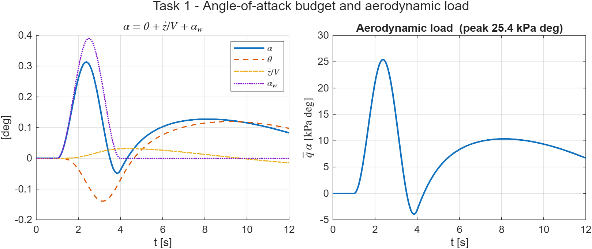

# HM3 — Attitude Control of a Launch Vehicle in Atmospheric Flight

Classical frequency-domain design of a thrust-vector-control (TVC) attitude
controller for the Greensite fictitious launch vehicle at the **max-q̄**
condition (`t = 72 s`). Pitch-plane short-period dynamics, wind-gust rejection,
bending-mode stabilisation via a notch filter, and a parametric robustness
study — all built around the **Nichols chart** as the primary stability tool.

> Course: *Dynamics and Control of Launch Vehicles* (Prof. A. Zavoli, AA 2025/26)
> — Homework 3, v1.2.

## Problem

The LV is modelled by the 6-state pitch-plane system of the assignment (Eq. 1),
states `[z, ż, θ, θ̇, η, η̇]` (lateral drift, pitch attitude, first bending mode),
control input `δ` (TVC deflection) and disturbance `α_w` (wind angle of attack).
At `t = 72 s` the airframe is **aerodynamically unstable** (open-loop pole at
`+√A₆ = +1.84 rad/s`), so feedback is mandatory. Key parameters (Table 1):

| `A₆ (μα)` | `K₁ (μc)` | `V` | `ω_BM` | `ζ_BM` | TVC |
|-----------|-----------|-----|--------|--------|-----|
| 3.382 s⁻² | 4.565 s⁻² | 937.7 m/s | 18.9 rad/s | 0.005 | ω=70, ζ=0.7, τ=20 ms |

Parameters are read at `t = 72 s` from the reference data set
`General/hw3-v3/GreensiteLPV_DATA.mat` (cross-checked against Table 1).

## Approach

A proportional–derivative attitude law with a weak negative drift feedback,

```
δ_cmd = Kp_θ (θ_ref − θ_m) − Kd_θ θ̇_m − Kp_z z_m − Kd_z ż_m
```

tuned on the open-loop Nichols chart. Because the airframe is open-loop
unstable, the loop is *conditionally stable* and `margin()` reports the
**low-frequency aerodynamic gain margin**; the assignment targets (|GM| ≈ 6 dB,
|PM| ≈ 30°) are therefore matched in magnitude.

| Task | Model | Result |
|------|-------|--------|
| **1** | Rigid body, ideal actuator | PD tuned to **\|GM\| = 6.0 dB, \|PM\| = 30°** (auto-tuner); equivalent pitch pair ω_c = 2.4 rad/s (course-typical 1–4) |
| **2** | + TVC + 20 ms delay + bending mode (INS coupling) | bending resonance is +39 dB → loop unstable; a **four-way filter trade** (Eq.-4 lead-lag alone, deep notch, notch triplet, notch+lead-lag) selects a **gain-stabilising notch** at ω_BM that restores stability and preserves the rigid margins |
| **3** | ±30 % on `μα` and `μc` | controller **fixed**; all four **uncertainty-box vertices** stable (worst, μα↑ μc↓: 1.5 dB / 9.1°) |

The lateral gains are `Kp_z = Kd_z = −1×10⁻³` (per the assignment guidelines);
the pitch gains found by the tuner are `Kp_θ = 1.98`, `Kd_θ = 1.40`.

## Results

### Task 1 — rigid LV

The Nichols curve threads between the two critical points (signature of
conditional stability) and clears the 6 dB contour; the response to a severe
wind gust (`V_g = 6.4 m/s`, peak `α_w = 0.39°`) keeps the pitch excursion below
0.14°. Since max-q̄ is the load-critical point, the angle-of-attack budget
`α = θ + ż/V + α_w` and the load indicator `q̄α` are also monitored: the loop
pitches slightly into the wind, so peak `α = 0.31°` stays *below* the wind
contribution (mild load relief), with `q̄α = 25 kPa·deg`.




### Task 2 — full model

Without compensation the +39 dB bending peak destabilises the loop (red).
Four bending filters are traded with fixed PD gains:

| Candidate | min \|GM\| [dB] | \|PM\| [°] | DM [ms] | \|L(ω_BM)\| [dB] | stable |
|-----------|----------------|-----------|---------|------------------|--------|
| Eq.-4 lead-lag alone (best of 75 in the suggested ranges) | 0.61 | 9.0 | — | +23.2 | ❌ |
| **deep notch (retained)** | 1.81 | 26.5 | 58.8 | −12.1 | ✅ |
| notch triplet 0.9/1/1.1·ω_BM | 1.48 | 11.6 | — | −46.0 | ❌ (~30° lag at the rigid crossover) |
| notch + lead-lag | 0.73 | 9.2 | 21.9 | −18.3 | ✅ |

The deep notch drives `|L(ω_BM)|` to −12 dB and keeps the rigid margins, with
the time response virtually unchanged from the rigid case. Its price is
**exact ω_BM knowledge**: ±5 % detuning destabilises the loop, while the
notch+lead-lag variant tolerates [−5 %, +10 %] at the cost of thinner nominal
margins — both documented in the report.


### Task 3 — robustness (±30 %)

The four **uncertainty-box vertices** (the assignment corner cases) plus the
one-at-a-time sensitivities S1–S4, all with the fixed Task-2 controller:

| Case | μα | μc | rigid \|GM\| [dB] | min \|GM\| [dB] | \|PM\| [°] | DM [ms] | peak θ [°] | peak z [m] | stable |
|------|----|----|------------------|----------------|-----------|---------|-----------|-----------|--------|
| Nominal | 1.00 | 1.00 | 6.58 | 1.81 | 26.5 | 58.8 | 0.132 | 2.37 | ✅ |
| V1 | 0.70 | 0.70 | 6.42 | 2.81 | 31.3 | 134.9 | 0.136 | 2.38 | ✅ |
| V2 | 0.70 | 1.30 | 11.68 | 0.88 | 11.3 | 19.2 | 0.061 | 1.67 | ✅ |
| **V3** | **1.30** | **0.70** | **1.53** | 1.53 | **9.1** | 156.4 | **0.353** | **4.20** | ✅ |
| V4 | 1.30 | 1.30 | 6.66 | 0.93 | 12.3 | 21.3 | 0.130 | 2.36 | ✅ |
| S1–S4 | one-at-a-time ±30 % | | 3.59–9.44 | 0.91–2.82 | 11.8–25.7 | 20–145 | 0.085–0.219 | 1.91–3.16 | ✅ |

`μα↑` erodes the **rigid** margin and the gust response, `μc↑` erodes the
**bending/delay** margins, and the worst-case vertex V3 (more unstable airframe
*and* less authority) compounds them to 1.5 dB / 9.1° — still stable, but the
quantitative argument for gain scheduling in a flight design. The S* rows
attribute the effects parameter by parameter.


## How to run

```matlab
cd HM3
main_task1      % rigid design + Nichols + gust response
main_task2      % full model: TVC + delay + bending notch
main_task3      % ±30% corner-case robustness study
```

Each script writes its figures to `figures/`. Requires the **Control System
Toolbox** (and the **Optimization Toolbox** for the PD auto-tuner).

### Simulink (optional, guided)

A block-diagram mirror is built interactively — the scripts remain the source of
truth. See [`models/SIMULINK_GUIDE.md`](models/SIMULINK_GUIDE.md);
`init_simulink_hm3.m` pre-computes every block parameter and
`run_simulink_closed_loop.m` overlays the model against the script.

## Files

| File | Role |
|------|------|
| `load_hw3_params.m` | parameters at `t = 72 s` (LPV data + Table 1) |
| `build_plant_rigid.m` / `build_plant_full.m` | 4-state / 6-state pitch-plane plant (Eq. 1–2) |
| `build_tvc.m` | TVC actuator + Pade delay (Eq. 3) |
| `build_notch_filter.m` | bending notch / lead-lag (Eq. 4) |
| `assemble_loop.m` | close the PD loop, return `L` (Nichols) and `T` (sim) |
| `design_controller.m` | auto-tune PD to the |GM|/|PM| targets |
| `load_wind_profile.m` / `simulate_gust_response.m` | wind gust + time response |
| `main_task1/2/3.m` | task entry points |
| `init_simulink_hm3.m` / `run_simulink_closed_loop.m` | Simulink track |
