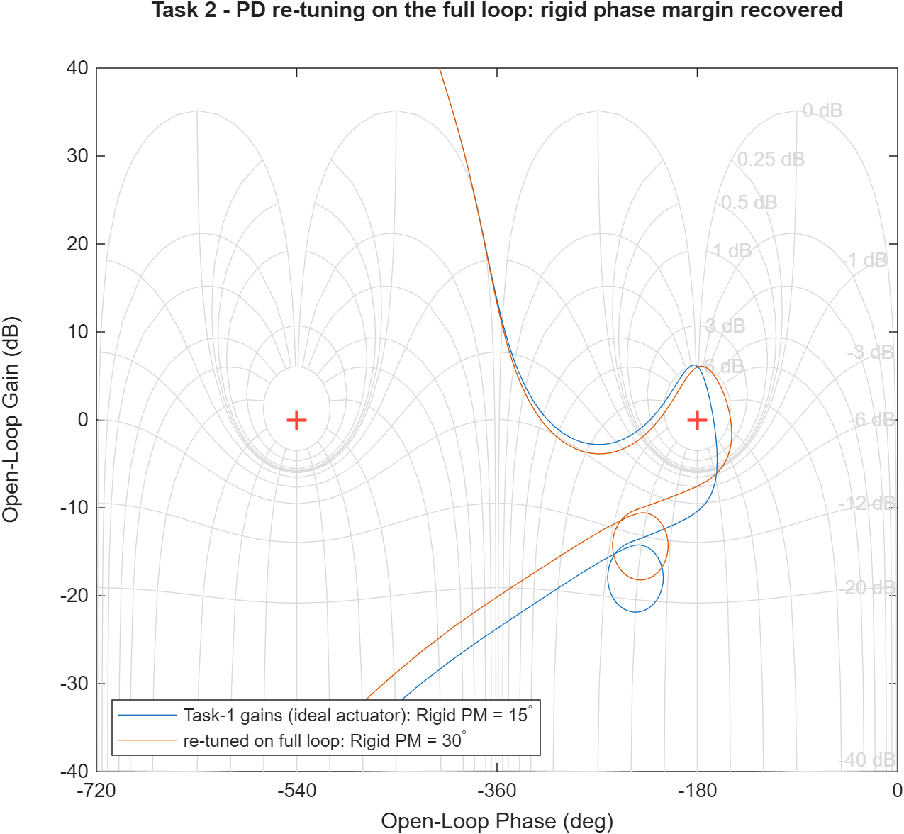

# HM3 — Attitude Control of a Launch Vehicle in Atmospheric Flight

Classical frequency-domain design of a thrust-vector-control (TVC) attitude
controller for the Greensite fictitious launch vehicle at the **max-q̄**
condition (`t = 72 s`). Pitch-plane short-period dynamics, wind-gust rejection,
bending-mode stabilisation via a notch filter, and a parametric robustness
study — all built around the **Nichols chart** as the primary stability tool.
Full write-up in [`report/main.pdf`](report/main.pdf).

> Course: *Dynamics and Control of Launch Vehicles* (Prof. A. Zavoli, AA 2025/26)
> — Homework 3, v1.2.

## Problem

The LV is modelled by the 6-state pitch-plane system of the assignment (Eq. 1),
states `[z, ż, θ, θ̇, η, η̇]` (lateral drift, pitch attitude, first bending mode),
control input `δ` (TVC deflection) and disturbance `α_w` (wind angle of attack).
At `t = 72 s` the airframe is **aerodynamically unstable** (open-loop pole at
`+√A₆ = +1.84 rad/s`), so feedback is mandatory. Key parameters (Table 1):

| `A₆ (μα)` | `K₁ (μc)` | `V` | `ω_BM` | `ζ_BM` | TVC |
|-----------|-----------|-----|--------|--------|-----|
| 3.382 s⁻² | 4.565 s⁻² | 937.7 m/s | 18.9 rad/s | 0.005 | ω=70, ζ=0.7, τ=20 ms |

Parameters are read at `t = 72 s` from the reference data set
`General/hw3-v3/GreensiteLPV_DATA.mat` (cross-checked against Table 1).

## Approach

A proportional–derivative attitude law with a weak negative drift feedback,

```
δ_cmd = Kp_θ (θ_ref − θ_m) − Kd_θ θ̇_m − Kp_z z_m − Kd_z ż_m
```

tuned on the open-loop Nichols chart. Because the airframe is open-loop
unstable the loop is *conditionally stable*, so a single `margin()` number is
meaningless: the margins are read on the full drift-coupled loop and
**classified by frequency band** (`classify_margins.m`) — the **aerodynamic
gain margin** at the low-frequency `−180°` crossing, the **rigid-body
phase/gain margins** at the control crossover, and the **delay margin**. The
PD gains are seeded by the analytic pole-placement pair
`Kp⁰ = 2A₆/K₁`, `Kd⁰ = √A₆/K₁` and then refined by a base-MATLAB
`fminsearch` auto-tuner to the assignment targets |GM| ≈ 6 dB, |PM| ≈ 30°.
The drift gains are fixed at `Kp_z = Kd_z = −1×10⁻³` (load relief, per the
assignment guidelines).

| Task | Model | Result |
|------|-------|--------|
| **1** | Rigid body, ideal actuator | `Kp_θ = 1.78`, `Kd_θ = 0.44` → **\|GM_a\| = 6.0 dB** @ 0.59 rad/s, **PM = 30°** @ 2.45 rad/s, delay margin 213 ms; equivalent pitch pair ω_c = 2.18 rad/s (in the course-typical 1–4 band), ζ = 0.46 |
| **2** | + TVC + 20 ms delay + bending mode (INS coupling) | the +29 dB bending resonance destabilises the loop; a **four-way filter trade** selects a **deep gain-stabilising notch**, and a **PD re-tune on the full loop** (`Kp_θ = 1.73`, `Kd_θ = 0.69`) restores 6 dB / 30° with the bending held at −18 dB |
| **3** | ±30 % on `μα` and `μc` | controller **fixed**; all four **uncertainty-box vertices** stable (worst, μα↑ μc↓: **0.91 dB / 18.0°**) |

## Results

### Task 1 — rigid LV

The Nichols curve threads between the two critical points (signature of
conditional stability) and clears the 6 dB contour. Against the assignment
wind gust (`V_g = 6.4 m/s`, peak `α_w = 0.39°`) the pitch attitude peaks at
0.26°, the TVC deflection at 0.53° and the lateral drift at 2.3 m. Since
max-q̄ is the load-critical point, the angle-of-attack budget
`α = θ + ż/V − α_w` and the load indicator `q̄α` are also monitored. The minus
sign is the plant's own (Eq. 1 has the wind column `Bw = [0, −a₁V, 0, −A₆, 0, 0]ᵀ`):
`α` is the incidence seen by the *air-relative* velocity. To hold attitude the loop
pitches *into* the relative wind (`θ → −0.26°` at the gust peak), and that **adds**
to the wind's own contribution: the peak total incidence (0.577°) therefore
**exceeds** the gust alone (0.39°). With `q̄ = 81 kPa` the peak load indicator is
`q̄α = 47 kPa·deg` — a pure attitude-hold law is mildly *load-aggravating*, which is
exactly why flight designs add explicit load relief. It still sits an order of
magnitude below typical slender-launcher limits, so the design is not load-critical
at this gust level.

The weak negative drift gains (`Kp_z = Kd_z = −1e-3`) are, first of all, a
**stability** requirement, not load relief: lateral position has no restoring force,
and with `Kp_z = Kd_z = 0` the closed loop keeps a pole exactly at the origin
(`{0, −0.076, −0.98 ± 1.93i}` — marginally stable, `z` never returns). The gains move
that pair to `−0.056 ± 0.233i`, cutting peak drift from 9.5 m to 2.3 m while changing
the peak incidence by ~1%.


### Task 2 — full model

Without compensation the +29 dB bending peak destabilises the loop.
Four bending filters are traded at the fixed Task-1 gains (margins classified
by frequency band):

| Candidate | Aero \|GM\| [dB] | Rigid \|PM\| [°] | Rigid \|GM\| [dB] | \|L(ω_BM)\| [dB] | DM [ms] | stable |
|-----------|-----------------|-----------------|------------------|------------------|---------|--------|
| no filter | 6.25 | 26.1 | — | +29.0 | — | ❌ |
| Eq.-4 lead-lag alone (best of 75) | 5.96 | 11.4 | 8.02 | +23.0 | 15 | barely |
| **deep notch (retained)** | 6.08 | 14.6 | 10.43 | −21.9 | 98 | ✅ |
| notch triplet 0.9/1/1.1·ω_BM | — | −7.3 | — | −55.8 | — | ❌ (~30° lag at the rigid crossover) |
| notch + lead-lag | 5.72 | 8.0 | 7.41 | −28.1 | 54 | ✅ |

The retained **deep minimum-phase notch** (`ζ_xN = 0.002`, `ζ_xD = 0.7`,
−51 dB depth) gain-stabilises the resonance, but with the Task-1 gains the
combined TVC + delay + notch phase lag collapses the rigid phase margin from
30° to 14.6°. The PD is therefore **re-tuned on the full loop**:

```
Kp_θ = 1.73,  Kd_θ = 0.69
```

which restores **PM = 30°** (at 3.2 rad/s) and a 165 ms delay margin, with the
bending lobe gain-stabilised at **|L(ω_BM)| = −18 dB** — an 18 dB bending gain
margin, above the ≥ 12 dB usually required of gain-stabilised modes. The gust
response is essentially the rigid one (peaks θ = 0.23°, z = 2.27 m, δ = 0.51°,
α = 0.565°, `q̄α = 45.8 kPa·deg`).

The price of the deep notch is **exact ω_BM knowledge**: with the filters
fixed it tolerates −10 % detuning but goes unstable at +5 % (the asymmetric
edge of its 0.08 rad/s null), while the notch+lead-lag variant holds the full
±10 % band at the cost of thinner nominal margins — both documented in the
report.




### Task 3 — robustness (±30 %)

The four **uncertainty-box vertices** (the assignment corner cases) plus the
one-at-a-time sensitivities S1–S4, all with the fixed Task-2 controller:

| Case | μα | μc | Aero \|GM\| [dB] | Rigid \|PM\| [°] | Rigid \|GM\| [dB] | DM [ms] | peak θ [°] | peak z [m] | stable |
|------|----|----|-----------------|-----------------|------------------|---------|-----------|-----------|--------|
| Nominal | 1.00 | 1.00 | 6.00 | 30.0 | 7.56 | 165 | 0.231 | 2.27 | ✅ |
| V1 | 0.70 | 0.70 | 5.70 | 26.6 | 8.70 | 196 | 0.241 | 2.28 | ✅ |
| V2 | 0.70 | 1.30 | 11.06 | 30.8 | 6.50 | 121 | 0.097 | 1.57 | ✅ |
| **V3** | **1.30** | **0.70** | **0.91** | **18.0** | 8.75 | 209 | **0.878** | **4.92** | ✅ |
| V4 | 1.30 | 1.30 | 6.17 | 30.9 | 6.57 | 135 | 0.222 | 2.26 | ✅ |
| S1–S4 | one-at-a-time ±30 % | | 2.95–8.79 | 23.6–30.9 | 6.54–8.72 | 128–206 | 0.142–0.417 | 1.80–3.19 | ✅ |

`μα↑` and `μc↓` erode the **aerodynamic** margin and amplify the gust
excursions; `μc↑` adds high-frequency loop gain and erodes the **rigid
gain/delay** margins. The worst-case vertex V3 (more unstable airframe *and*
less control authority) compounds them to **0.91 dB / 18.0°** with 0.88° of
pitch and 4.9 m of drift — still stable, but the quantitative argument for
gain scheduling in a flight design. The S* rows attribute the effects
parameter by parameter.


## How to run

```matlab
cd HM3
main_task1        % rigid design + Nichols + gust response
main_task2        % full model: TVC + delay + bending-filter trade + re-tune
main_task3        % ±30% corner-case robustness study
main_montecarlo   % (extra) N=1500 Monte Carlo margin dispersion
```

Each script writes its figures to `figures/`. Requires the **Control System
Toolbox** only (the PD auto-tuner uses base-MATLAB `fminsearch`);
`main_montecarlo.m` uses the Parallel Computing Toolbox if present and
degrades to serial otherwise. Tests: `runtests('tests')`.

### Simulink (optional)

The closed loop is mirrored in Simulink
([`models/hm3_closed_loop.slx`](models/)): `init_simulink_hm3.m` computes
every block parameter from the scripts (which remain the source of truth) and
`run_simulink_closed_loop.m` overlays the model response against the script
baseline (`figures/task*_simulink_vs_script.png`). The reproduction — driven
by the professor's wind generator — is documented in the dedicated report
[`report/main_full_simulink.pdf`](report/main_full_simulink.pdf); see
[`models/SIMULINK_GUIDE.md`](models/SIMULINK_GUIDE.md).

### Beyond the assignment

- **Monte Carlo robustness** ([`main_montecarlo.m`](main_montecarlo.m)):
  N = 1500 draws over five uncertain factors (`μα`, `μc`, `ω_BM`, `ζ_BM`,
  TVC delay) producing margin histograms, a Nichols cloud, and per-parameter
  sensitivities (`figures/mc_*.png`).
- **Full-ascent LPV extension** ([`LTV_FULL_ASCENT/`](LTV_FULL_ASCENT/)):
  the frozen-time design lifted to the whole ascent (0–140 s) — time-varying
  rigid plant gridded on `GreensiteLPV_DATA.mat`, the professor's wind
  generator wired directly into the loop, and **gain-scheduled** (time- and
  q̄-scheduled) controllers compared against the single max-q̄ design (peak
  lateral drift cut from 33 m to 27 m). The Simulink models are authored from
  scripts and validated against an LTV `ode45` baseline to ≈1×10⁻⁷ rad.
  Not part of the HM3 deliverable.

## Files

| File | Role |
|------|------|
| `load_hw3_params.m` | parameters at `t = 72 s` (LPV data + Table 1) |
| `build_plant_rigid.m` / `build_plant_full.m` | 4-state / 6-state pitch-plane plant (Eq. 1–2) |
| `build_tvc.m` | TVC actuator + Pade delay (Eq. 3) |
| `build_notch_filter.m` | bending notch / lead-lag (Eq. 4) |
| `assemble_loop.m` | close the PD loop, return `L` (Nichols) and `T` (sim) |
| `design_controller.m` | auto-tune PD to the \|GM\|/\|PM\| targets |
| `classify_margins.m` | frequency-classified margins (aero / rigid / delay) |
| `plot_nichols_lv.m` / `make_pz_figures.m` | Nichols in LV convention, pole-zero figures |
| `load_wind_profile.m` / `simulate_gust_response.m` | wind gust + time response |
| `main_task1/2/3.m`, `main_montecarlo.m` | entry points |
| `init_simulink_hm3.m` / `run_simulink_closed_loop.m` | Simulink track |
| `tests/` | `matlab.unittest` regression + `matlab.perftest` benchmarks |
| `report/` | LaTeX sources + compiled `main.pdf`, `main_full_simulink.pdf` |
