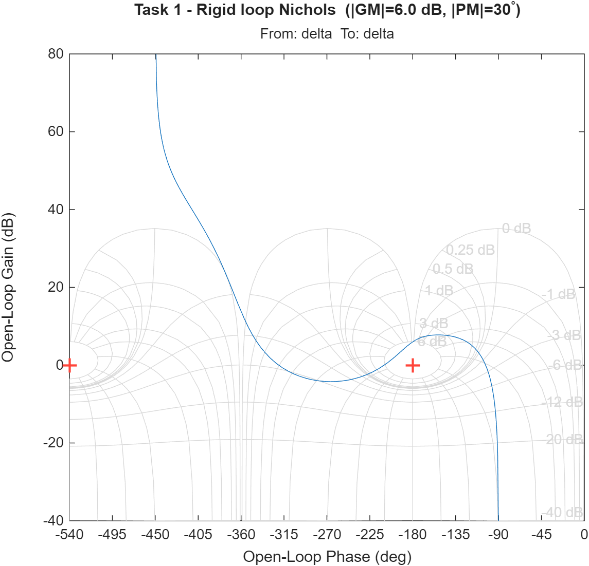
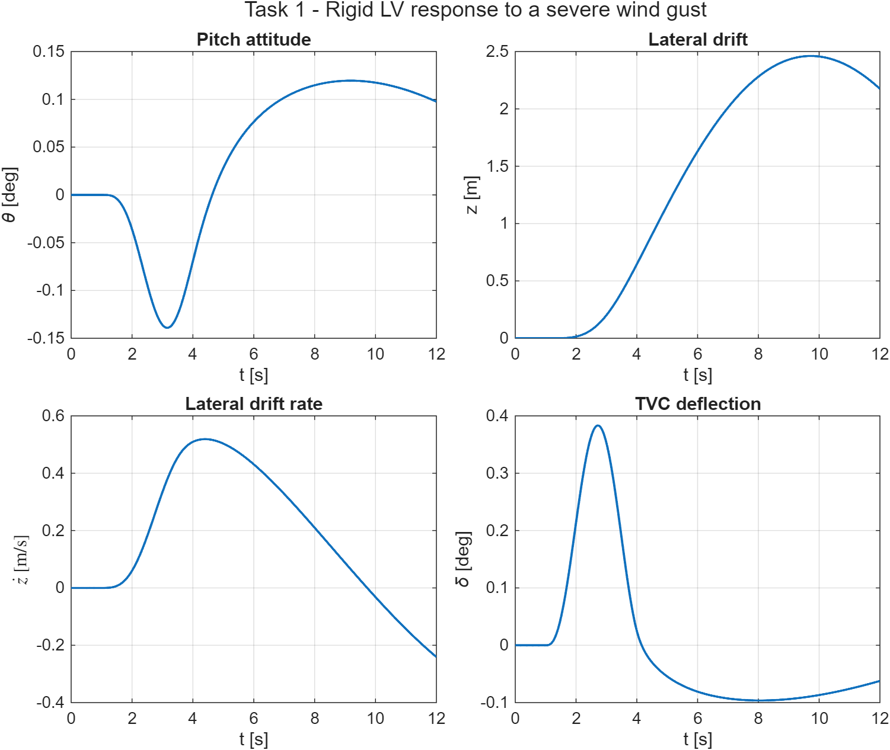
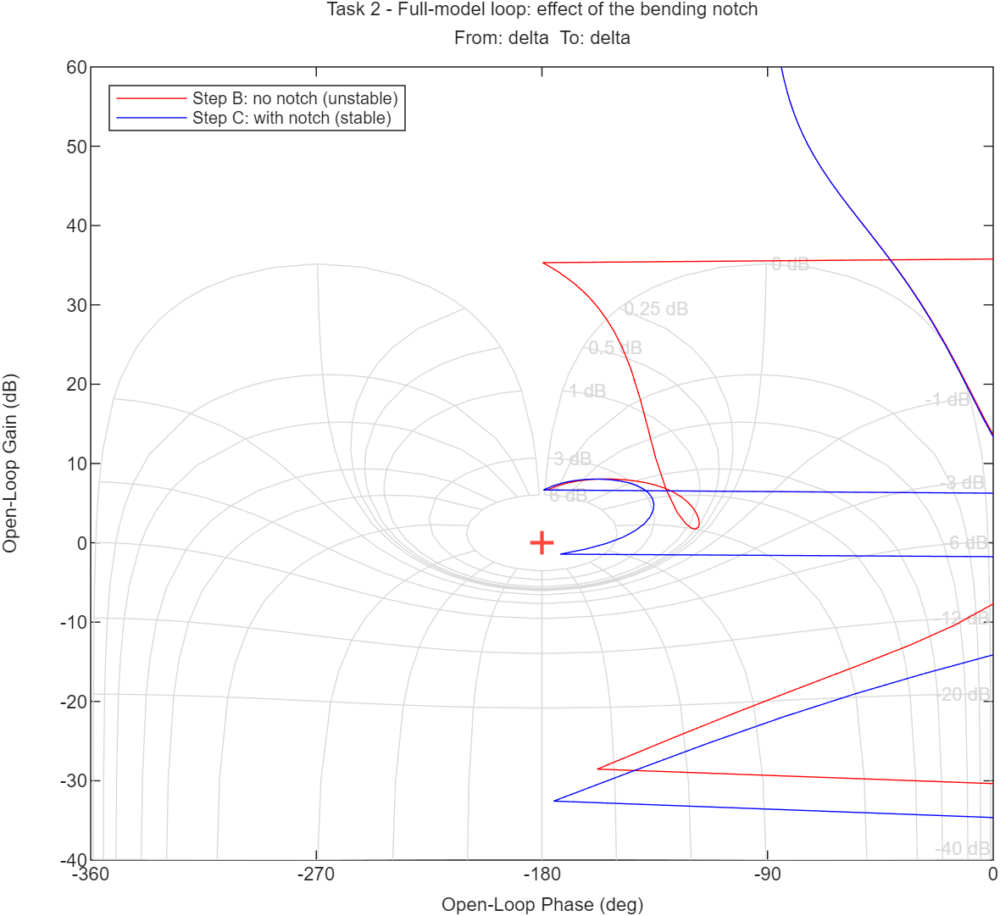
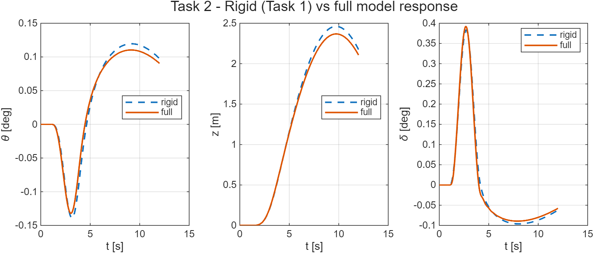
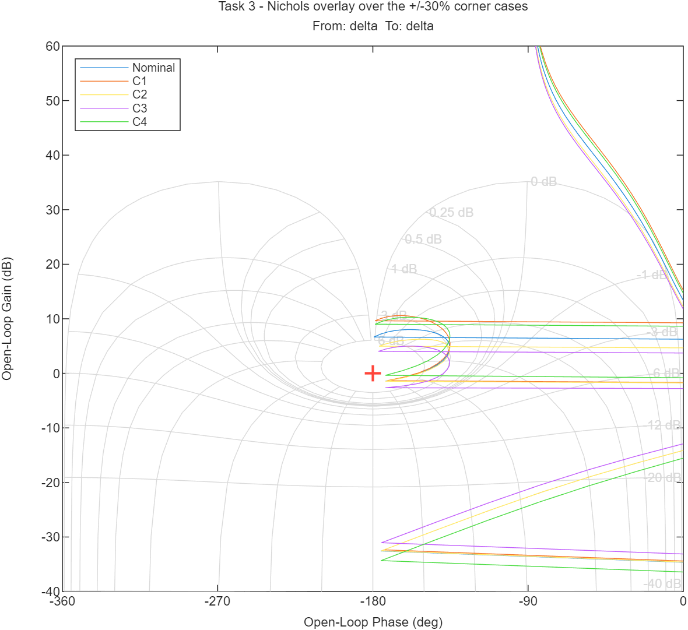
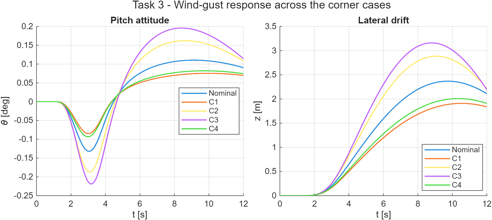

# HM3 — Attitude Control of a Launch Vehicle in Atmospheric Flight

Classical frequency-domain design of a thrust-vector-control (TVC) attitude
controller for the Greensite fictitious launch vehicle at the **max-q̄**
condition (`t = 72 s`). Pitch-plane short-period dynamics, wind-gust rejection,
bending-mode stabilisation via a notch filter, and a parametric robustness
study — all built around the **Nichols chart** as the primary stability tool.

> Course: *Dynamics and Control of Launch Vehicles* (Prof. A. Zavoli, AA 2025/26)
> — Homework 3, v1.2.

## Problem

The LV is modelled by the 6-state pitch-plane system of the assignment (Eq. 1),
states `[z, ż, θ, θ̇, η, η̇]` (lateral drift, pitch attitude, first bending mode),
control input `δ` (TVC deflection) and disturbance `α_w` (wind angle of attack).
At `t = 72 s` the airframe is **aerodynamically unstable** (open-loop pole at
`+√A₆ = +1.84 rad/s`), so feedback is mandatory. Key parameters (Table 1):

| `A₆ (μα)` | `K₁ (μc)` | `V` | `ω_BM` | `ζ_BM` | TVC |
|-----------|-----------|-----|--------|--------|-----|
| 3.382 s⁻² | 4.565 s⁻² | 937.7 m/s | 18.9 rad/s | 0.005 | ω=70, ζ=0.7, τ=20 ms |

Parameters are read at `t = 72 s` from the reference data set
`General/hw3-v3/GreensiteLPV_DATA.mat` (cross-checked against Table 1).

## Approach

A proportional–derivative attitude law with a weak negative drift feedback,

```
δ_cmd = Kp_θ (θ_ref − θ_m) − Kd_θ θ̇_m − Kp_z z_m − Kd_z ż_m
```

tuned on the open-loop Nichols chart. Because the airframe is open-loop
unstable, the loop is *conditionally stable* and `margin()` reports the
**low-frequency aerodynamic gain margin**; the assignment targets (|GM| ≈ 6 dB,
|PM| ≈ 30°) are therefore matched in magnitude.

| Task | Model | Result |
|------|-------|--------|
| **1** | Rigid body, ideal actuator | PD tuned to **\|GM\| = 6.0 dB, \|PM\| = 30°** (auto-tuner) |
| **2** | + TVC + 20 ms delay + bending mode (INS coupling) | bending resonance is +39 dB → loop unstable; a **gain-stabilising notch** (Eq. 4) at ω_BM restores stability while preserving the rigid margins |
| **3** | ±30 % on `μα` and `μc` (4 corners) | controller **fixed**; all corners remain stable |

The lateral gains are `Kp_z = Kd_z = −1×10⁻³` (per the assignment guidelines);
the pitch gains found by the tuner are `Kp_θ = 1.98`, `Kd_θ = 1.40`.

## Results

### Task 1 — rigid LV

The Nichols curve threads between the two critical points (signature of
conditional stability) and clears the 6 dB contour; the response to a severe
wind gust (`V_g = 6.4 m/s`) keeps the pitch excursion below 0.14°.




### Task 2 — full model

Without the notch the +39 dB bending peak destabilises the loop (red); the notch
drives `|L(ω_BM)|` to −12 dB and recovers stability (blue), with the time
response virtually unchanged from the rigid case.




### Task 3 — robustness (±30 %)

| Case | μα | μc | rigid \|GM\| [dB] | \|PM\| [°] | peak θ [°] | peak z [m] | stable |
|------|----|----|------------------|-----------|-----------|-----------|--------|
| Nominal | 1.00 | 1.00 | 6.58 | 26.5 | 0.132 | 2.37 | ✅ |
| C1 | 0.70 | 1.00 | 9.44 | 25.7 | 0.085 | 1.91 | ✅ |
| C2 | 1.30 | 1.00 | 4.47 | 22.1 | 0.187 | 2.88 | ✅ |
| C3 | 1.00 | 0.70 | 3.59 | 18.6 | 0.219 | 3.16 | ✅ |
| C4 | 1.00 | 1.30 | 8.79 | 11.8 | 0.093 | 2.01 | ✅ |

Higher aerodynamic instability (`μα↑`, C2) erodes the **rigid** margin and
worsens the gust response, while higher control authority (`μc↑`, C4) raises the
loop gain and erodes the **bending** margin — the two uncertainties stress
different parts of the loop, but the fixed controller tolerates the full ±30 %
box.




## How to run

```matlab
cd HM3
main_task1      % rigid design + Nichols + gust response
main_task2      % full model: TVC + delay + bending notch
main_task3      % ±30% corner-case robustness study
```

Each script writes its figures to `figures/`. Requires the **Control System
Toolbox** (and the **Optimization Toolbox** for the PD auto-tuner).

### Simulink (optional, guided)

A block-diagram mirror is built interactively — the scripts remain the source of
truth. See [`models/SIMULINK_GUIDE.md`](models/SIMULINK_GUIDE.md);
`init_simulink_hm3.m` pre-computes every block parameter and
`run_simulink_closed_loop.m` overlays the model against the script.

## Files

| File | Role |
|------|------|
| `load_hw3_params.m` | parameters at `t = 72 s` (LPV data + Table 1) |
| `build_plant_rigid.m` / `build_plant_full.m` | 4-state / 6-state pitch-plane plant (Eq. 1–2) |
| `build_tvc.m` | TVC actuator + Pade delay (Eq. 3) |
| `build_notch_filter.m` | bending notch / lead-lag (Eq. 4) |
| `assemble_loop.m` | close the PD loop, return `L` (Nichols) and `T` (sim) |
| `design_controller.m` | auto-tune PD to the |GM|/|PM| targets |
| `load_wind_profile.m` / `simulate_gust_response.m` | wind gust + time response |
| `main_task1/2/3.m` | task entry points |
| `init_simulink_hm3.m` / `run_simulink_closed_loop.m` | Simulink track |
