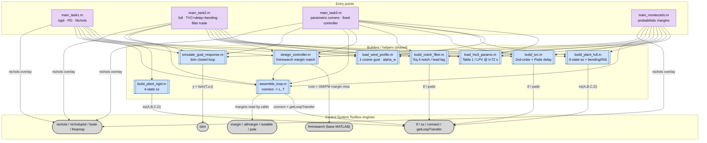
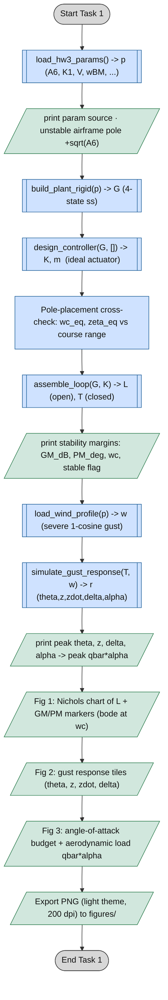
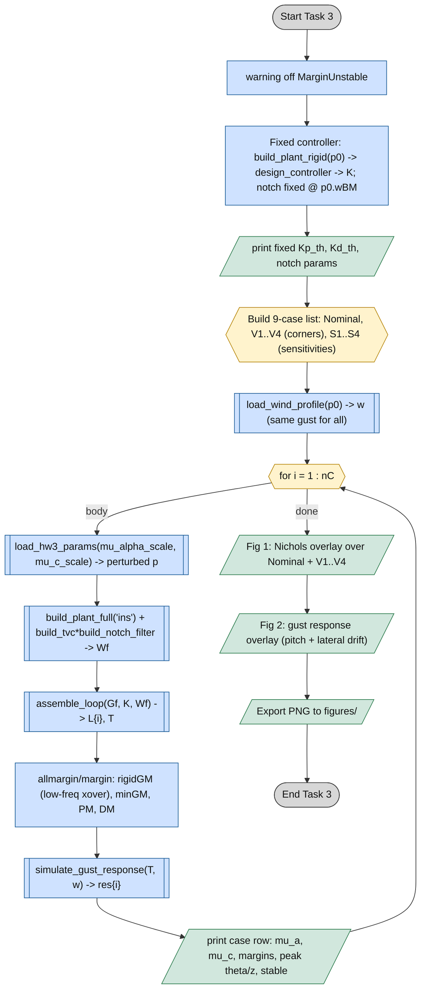
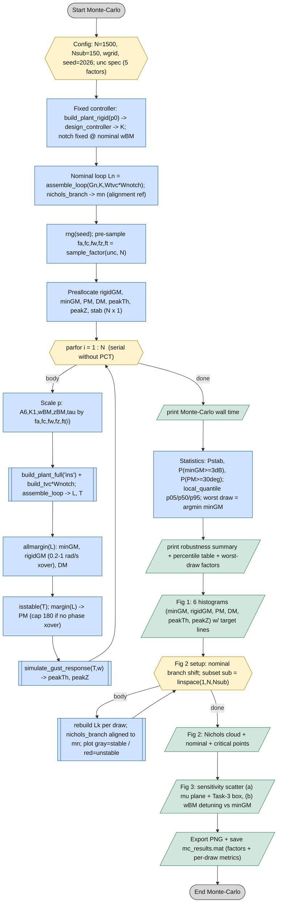
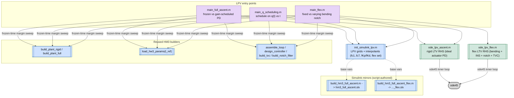
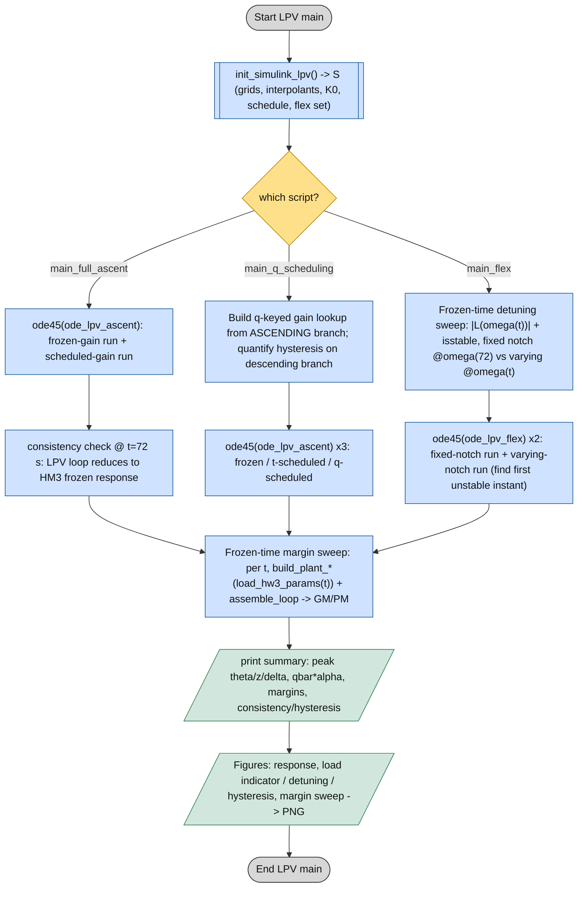

# HM3 — Control-Flow Diagrams (ISO 5807)

Detailed, color-coded step-by-step flowcharts of the three task entry-point
scripts, the Monte-Carlo robustness study, the shared plant/filter builders,
and the LPV full-ascent extension in this folder, obtained by static reading of
the source. Symbols follow **ISO 5807** (terminator, process, predefined
process, decision, preparation, data I/O) and are mapped onto Mermaid node
shapes — and colored by category — so the diagrams render natively on GitHub.

Unlike HM1 (indirect ODE shooting), HM3 is a **classical frequency-domain
control** study: the numerical engines are Control System Toolbox functions
(`tf`/`ss`/`connect`, `margin`/`allmargin`, `nichols`, `getLoopTransfer`,
`lsim`) plus a base-MATLAB `fminsearch` margin-matching tuner and a Monte-Carlo
loop. Every task script follows the same spine: **load params → build plant
(rigid/full) → design PD + notch → assemble open/closed loop → frequency
margins / Nichols → gust time response → plots/export**.

## Symbol & color legend

| ISO 5807 symbol | Meaning | Mermaid node | Color |
|---|---|---|---|
| Terminator (stadium) | Start / End | `([ ... ])` | grey |
| Preparation (hexagon) | Setup / loop init | `{{ ... }}` | amber |
| Process / predefined | Operation / solver call | `[ ... ]` · `[[ ... ]]` | blue |
| Decision (rhombus) | Conditional branch | `{ ... }` | yellow |
| Data I/O (parallelogram) | print / figure / export | `[/ ... /]` | green |
| — | Error / abort path | — | red |

---

## 0 · Code architecture (call graph)

How the three task scripts and the Monte-Carlo study sit on a shared set of
builders/helpers and on the Control System Toolbox engines. The three task
scripts reuse the *same* PD design (`design_controller`) and the *same* loop
assembly (`assemble_loop`); they differ only in which plant builder they call
and how much of the filter chain they bolt on.

> **Simulink mirror (brief).** `init_simulink_hm3.m` precomputes all block
> parameters (split plant matrices, gains, `tvc_num/den`, `notch_num/den`, wind
> timeseries) and `run_simulink_closed_loop.m` simulates the hand-built
> `models/hm3_closed_loop.slx` and overlays it on the script response. The
> scripts are the source of truth; the `.slx` only replays the same controller
> and plant. Both return cleanly with a message if the model file is absent.

---

## 1 · Task 1 — Rigid LV attitude control at max-q

Single design point (`t = 72 s`, max-q). Rigid 4-state plant, ideal actuator,
PD pitch + weak negative drift feedback tuned to `|GM| ≈ 6 dB` / `|PM| ≈ 30°`,
checked on Nichols and against a wind-gust time response.

---

## 2 · Task 2 — Full model: TVC, transport delay, bending notch trade

Extends Task 1 to the 6-state plant (lightly damped first bending mode +
2nd-order TVC + 20 ms Pade delay + INS coupling). Four steps: reuse the rigid
PD (A), expose the resonance instability (B), sweep four bending-filter
candidates (C), then test off-nominal `wBM` (D).

```mermaid
flowchart TD
  s2([Start Task 2]):::term --> mute["warning off MarginUnstable"]:::proc
  mute --> p2[["load_hw3_params() -> p"]]:::proc
  p2 --> stepA["Step A: build_plant_rigid -> design_controller -> assemble_loop -> Trigid (reuse Task-1 PD)"]:::proc
  stepA --> stepB[["Step B: build_plant_full('ins') + build_tvc(p,3); assemble_loop(G,K,Wtvc)"]]:::proc
  stepB --> bchk[/"print |L(wBM)| dB, isstable(Tb) -> resonance destabilises"/]:::io
  bchk --> cprep{{"Step C setup: grids wx=wBM±4, zN=0.1:0.3, zD=0.4:0.6"}}:::setup
  cprep --> cLL{{"C-LL sweep: for each (wx,zN,zD) lead-lag (sgn=-1)"}}:::setup
  cLL -->|body| cLLa[["assemble_loop(G,K,Wtvc*Hc); track isstable, max Re(pole)"]]:::proc
  cLLa --> cLL
  cLL -->|done| cLLr[/"print C-LL: how many stabilise · least-unstable combo"/]:::io
  cLLr --> cN["C-N: deep min-phase notch at wBM (zN=0.002, zD=0.7, sgn=+1) = retained"]:::proc
  cN --> cT["C-T: triplet notch at 0.9/1.0/1.1 wBM"]:::proc
  cT --> cNLL{{"C-NLL sweep: notch Hn * lead-lag partner"}}:::setup
  cNLL -->|body| cNLLa[["assemble_loop(G,K,Wtvc*Hn*Hc); if stable, allmargin -> DelayMargin"]]:::proc
  cNLLa --> keepdm{"stable? higher DM than best?"}:::decision
  keepdm -->|yes| cNLLu["update bestC (max DM)"]:::proc --> cNLL
  keepdm -->|no| cNLL
  cNLL -->|done| ctab["Comparison table: for each candidate assemble_loop + allmargin/margin"]:::proc
  ctab --> ctabp[/"print rigidGM, minGM, PM, DM, |L(wBM)|, stable per candidate"/]:::io
  ctabp --> decide["Decision: deep notch retained (Wfull = Wtvc*Hn) -> Lc, Tfull"]:::proc
  decide --> dsum[/"print retained design margins (GM/PM preserved, extra delay margin)"/]:::io
  dsum --> stepD{{"Step D: scales = 0.90:0.05:1.10 (true wBM off-nominal, filters fixed)"}}:::setup
  stepD -->|body| dscan[["per candidate C-N/C-T/C-NLL: rescale wBM, build_plant_full, assemble_loop, isstable"]]:::proc
  dscan --> stepD
  stepD -->|done| dtab[/"print stability table vs wBM scale"/]:::io
  dtab --> g2[["load_wind_profile + simulate_gust_response(Tfull) and (Trigid)"]]:::proc
  g2 --> g2p[/"print full-model gust peaks"/]:::io
  g2p --> f2a[/"Fig 1: Nichols trade (no filter vs lead-lag vs deep notch)"/]:::io
  f2a --> f2b[/"Fig 2: full-model gust tiles"/]:::io
  f2b --> f2c[/"Fig 3: rigid (Task 1) vs full response comparison"/]:::io
  f2c --> exp2[/"Export PNG to figures/"/]:::io
  exp2 --> e2([End Task 2]):::term

  classDef term fill:#d7d7d7,stroke:#333,color:#111
  classDef setup fill:#fff3cd,stroke:#b8860b,color:#111
  classDef proc fill:#cfe2ff,stroke:#1c5d99,color:#111
  classDef io fill:#d1e7dd,stroke:#2e7d4f,color:#111
  classDef decision fill:#ffe08a,stroke:#b8860b,color:#111
  classDef err fill:#f8d7da,stroke:#b02a37,color:#111
```

---

## 3 · Task 3 — Parametric robustness (corner cases)

Controller **fixed** at the Task-2 design (no re-tuning). Sweep nine cases:
nominal, four `±30 %` box vertices `V1..V4` (the assignment corners), and four
one-at-a-time sensitivities `S1..S4`. Per case: rebuild loop, read GM/PM/DM,
run the gust sim.

---

## 4 · Monte-Carlo — probabilistic margin robustness

Probabilistic counterpart of Task 3. Five uncertain factors are pre-sampled
(seeded, outside the `parfor`), each draw reassembles `L` with the **fixed**
Task-2 controller and notch, and margins/metrics are collected into
distributions, quantiles, a Nichols cloud, and sensitivity scatters.

> **Local helpers (`main_montecarlo`).** `sample_factor` draws `gauss`
> (truncated by resampling), `uniform`, or `lognorm` multiplicative factors;
> `nichols_branch` returns aligned `(gain dB, phase deg)` and shifts the phase
> by `360k` to keep the cloud on one branch; `print_pct` / `local_quantile`
> give Statistics-Toolbox-free percentiles; `hist_metric` draws one histogram
> tile with a median line and an optional reference target.

---

## 5 · LTV full-ascent extension (`LTV_FULL_ASCENT/`)

Portfolio showcase beyond the assignment (the deliverable is the max-q point
only). The frozen HM3 design is lifted to a **time-varying (LPV)** plant from
`GreensiteLPV_DATA.mat` so the wind generator (`strong_wind.slx`, 0–140 s) and
the dynamics share one clock. `ode45` is the source of truth; two
script-authored `.slx` mirrors reproduce it.

### 5.0 Call graph

### 5.1 LPV mains (higher-level flow)

All three share the spine: `init_simulink_lpv` → `ode45` over the ascent (one
run per controller variant) → frozen-time margin sweep (freeze the plant at
each instant, read margins) → summary → figures/export.

> **LPV RHS files.** `ode_lpv_ascent` (4-state rigid) and `ode_lpv_flex`
> (13-state: 6 plant + 2 notch + TVC) carry **no `arguments` validation by
> design** — they sit in the `ode45` inner loop. The PD is closed inside the
> RHS (`theta_ref = 0`); coefficients are `griddedInterpolant` handles
> evaluated at `t`. `build_hm3_full_ascent[_flex].m` author the `.slx` mirrors
> block-by-block (1-D lookups on flight time, a read-only copy of the
> professor's `strong_wind/Subsystem`, integrator chains); they never modify the
> source generator.

---

## 6 · Shared subroutines / builders

The builders are pure constructors (params → LTI object); `assemble_loop` is
the one place the loop topology lives; `simulate_gust_response` is the only
time-domain call. Left: how `assemble_loop` closes the loop and breaks it for
analysis. Right: the `design_controller` margin-matching search.

```mermaid
flowchart TD
  subgraph A["assemble_loop(G, K, Wact)"]
    al([Entry: plant G, gains K, actuator chain Wact]):::term --> aw{"Wact empty?"}:::decision
    aw -->|yes| aw1["Wact = tf(1)  (ideal actuator)"]:::proc --> kc
    aw -->|no| kc["Build static controller gain block Kc (named IO): u_pd from theta_ref, theta_m, thetadot_m, z_m, zdot_m"]:::proc
    kc --> chain["Actuator/filter chain Wa: u_pd -> delta"]:::proc
    chain --> conn[["T = connect(G, Kc, Wa) keeping 'delta' as analysis point"]]:::proc
    conn --> lt[["L = getLoopTransfer(T,'delta',-1); L = minreal(tf(L))"]]:::proc
    lt --> aret(["return L (open), T (closed), info"]):::term
  end

  subgraph B["design_controller(G, Wact)"]
    dc([Entry: targets GM=6 dB, PM=30 deg; K0 guess; fixed lateral gains]):::term --> mw["mute MarginUnstable warning (onCleanup restore)"]:::proc
    mw --> fs[["fminsearch(cost, log(K0))"]]:::proc
    fs --> cost["cost(x): Kp_th,Kd_th = exp(x); assemble_loop; margin -> (|GM|-6)^2+(|PM|-30)^2; +1e4 if unstable; +1e6 if non-finite"]:::proc
    cost --> fs
    fs --> kbuild["K = exp(xopt); re-assemble; margin -> m struct"]:::proc
    kbuild --> dret([return K, m]):::term
  end

  classDef term fill:#d7d7d7,stroke:#333,color:#111
  classDef proc fill:#cfe2ff,stroke:#1c5d99,color:#111
  classDef decision fill:#ffe08a,stroke:#b8860b,color:#111
```

```mermaid
flowchart TD
  subgraph P["Plant builders"]
    pr(["build_plant_rigid(p)"]):::term --> pra["A,Bd,Bw from a1,a3,a4,A6,K1,V; C = 4 meas + 3 plot rows"]:::proc
    pra --> prr(["ss(A,[Bd Bw],C,D): 4 states [z zdot theta thetadot]"]):::term
    pf(["build_plant_full(p, meas)"]):::term --> pfa["Augment with bending [eta etadot]: -wBM^2, -2 zBM wBM; phi_tvc*Tc forcing"]:::proc
    pfa --> pfm{"meas = 'ins'?"}:::decision
    pfm -->|ins| pfi["Cm leaks bending: sigma_ins, phi_ins into theta_m/z_m (Eq. 2)"]:::proc
    pfm -->|true| pft["Cm = clean states"]:::proc
    pfi --> pfr
    pft --> pfr(["ss: 6 states"]):::term
  end

  subgraph F["Filter / actuator builders"]
    bt2(["build_tvc(p, padeOrder)"]):::term --> bta["Wact = wTVC^2/(s^2+2 zTVC wTVC s+wTVC^2)"]:::proc
    bta --> btp["[nd,dd] = pade(tau, order); Wtvc = Wact * tf(nd,dd)"]:::proc
    btp --> btr(["return Wtvc"]):::term
    bn2(["build_notch_filter(wx, zN, zD, numSign)"]):::term --> bnn["num=[1 sgn*2 zN wx wx^2]; den=[1 2 zD wx wx^2] (Eq. 4)"]:::proc
    bnn --> bnr(["return Hx (sgn=-1 NMP lead-lag / +1 min-phase notch)"]):::term
  end

  subgraph G["Inputs + time-domain"]
    lp2(["load_hw3_params(opt)"]):::term --> lpd{"GreensiteLPV_DATA.mat present?"}:::decision
    lpd -->|yes| lpi["interp LPV coeffs @ t_ref"]:::proc --> lps
    lpd -->|no| lpl["Table 1 literals"]:::proc --> lps
    lps["derive rho, qbar; apply mu_alpha/mu_c scaling"]:::proc --> lpr(["return p"]):::term
    lw2(["load_wind_profile(p, o)"]):::term --> lwg["gust/step/doublet alpha_w = vw/V (or strong_wind.slx windowed)"]:::proc
    lwg --> lwr(["return w (t, vw, alphaw)"]):::term
    sg2(["simulate_gust_response(T, w)"]):::term --> sgl[["y = lsim(T, [alpha_w, theta_ref=0], t)"]]:::proc
    sgl --> sga["alpha = theta + zdot/V + alpha_w; peak_* metrics"]:::proc
    sga --> sgr(["return r"]):::term
  end

  classDef term fill:#d7d7d7,stroke:#333,color:#111
  classDef proc fill:#cfe2ff,stroke:#1c5d99,color:#111
  classDef decision fill:#ffe08a,stroke:#b8860b,color:#111
```

> **Note.** The airframe is open-loop unstable (`+sqrt(A6)`), so the loop is
> *conditionally* stable: `|GM|`/`|PM|` are matched in **magnitude** (Nichols),
> and the binding stability indicator throughout is the `isstable()` flag, not
> the sign of the gain margin. The lateral drift gains `Kp_z, Kd_z` are held
> fixed (small, negative) — only the pitch PD pair is tuned.
