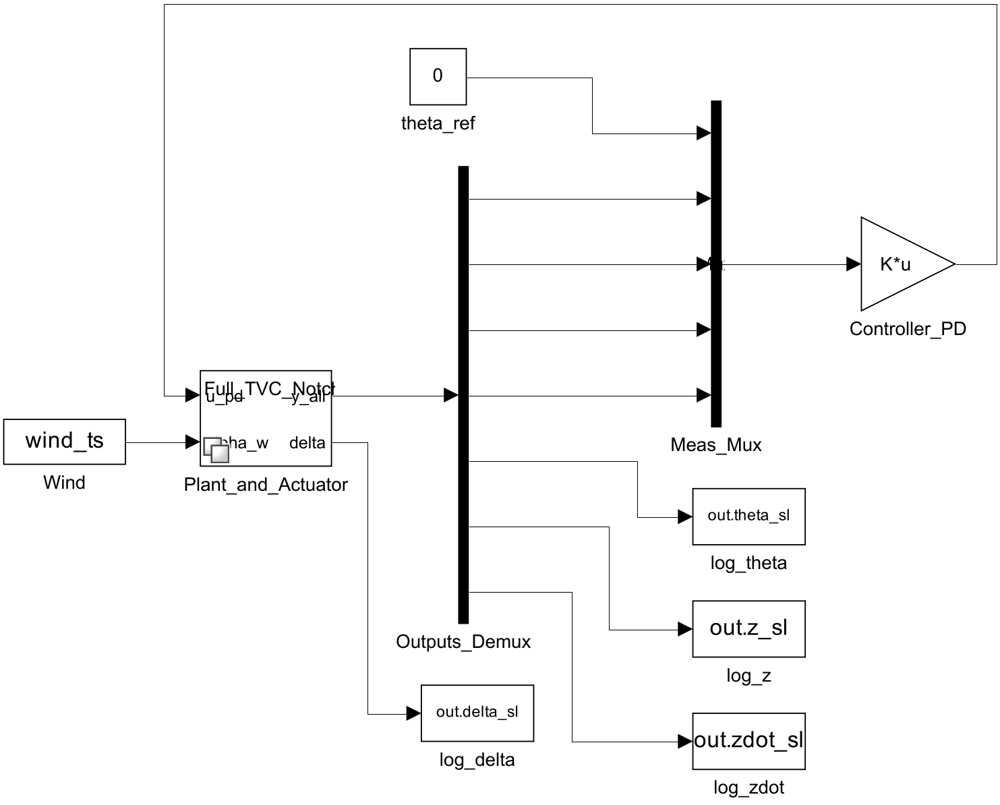
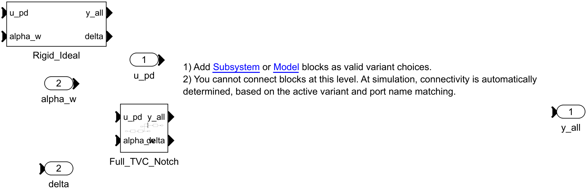
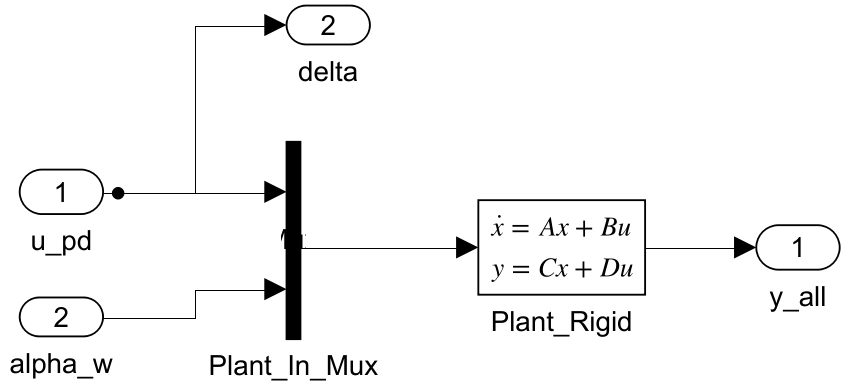
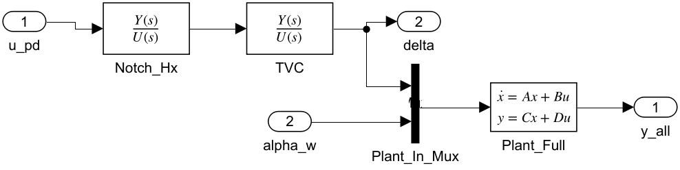

# HM3 — Building `hm3_closed_loop.slx`, step by step

This is a hand-holding walkthrough for rebuilding the Simulink mirror of the
HM3 control design from a blank canvas. The **MATLAB scripts remain the source
of truth**: every gain, filter and matrix is computed by `main_task1/2/3.m`
and exported by `init_simulink_hm3.m`; the model only *references* those
workspace variables, so nothing is ever typed in by hand and re-running the
init script re-tunes the model automatically.

The model in this folder was built exactly as described below and validated
against the scripts: the script-vs-Simulink overlay agrees to ~1e-7 rad in
pitch for Task 1 and ~1e-8 rad for Task 2 and every Task 3 corner — i.e. to
solver tolerance.

What it looks like when you are done:

| View | Snapshot |
|------|----------|
| Root (closed loop) |  |
| Variant subsystem (the two plant choices) |  |
| `Rigid_Ideal` choice (Task 1) |  |
| `Full_TVC_Notch` choice (Tasks 2–3) |  |

---

## 0. The idea in one paragraph

The closed loop has four players: a **PD controller** (one Gain block), an
**actuator path** (notch filter + TVC servo with delay — or nothing, in
Task 1), a **plant** (one State-Space block, rigid 4-state or flexible
6-state), and a **wind disturbance** `alpha_w(t)`. Task 1 and Tasks 2–3
differ *only* in the actuator path and the plant matrices, so both live
inside one **Variant Subsystem** with two choices; the workspace variable
`task` (pushed by `init_simulink_hm3`) picks the active one at simulation
time. Everything else — controller, wind, logging — is shared and built once.

The measurement vector convention everywhere is
`y_meas = [theta_m, thetadot_m, z_m, zdot_m]` (INS outputs, bending-
contaminated in the full plant) and the plot vector is `[theta, z, zdot]`
(true states). The plant block outputs all seven, stacked.

## 1. Before you touch Simulink

```matlab
cd HM3
S = init_simulink_hm3(2);    % task = 1 | 2 | 3; pushes variables to base ws
```

Every block parameter below is one of these workspace variables:

| Variable | Meaning |
|----------|---------|
| `A_rigid`, `Bdelta_rigid`, `Bwind_rigid` | rigid 4-state plant; B split into the `delta` and `alpha_w` columns |
| `C_meas_rigid` (4×4), `C_plot_rigid` (3×4) | measurement / plot output rows |
| `A_full`, `Bdelta_full`, `Bwind_full` | full 6-state plant (adds bending states `eta`, `etadot`) |
| `C_meas_full` (4×6), `C_plot_full` (3×6) | INS rows include bending contamination (Eq. 2); plot rows are the true states |
| `Kp_th`, `Kd_th`, `Kp_z`, `Kd_z` | PD gains — **frozen at the nominal design** (tuned once on the nominal rigid plant; Task 3 corners do *not* re-tune them, that is the whole point of a robustness study) |
| `tvc_num`, `tvc_den` | TVC 2nd-order servo × 3rd-order Padé delay (Eq. 3) |
| `notch_num`, `notch_den` | bending notch, minimum-phase variant (Eq. 4, `numSign=+1`), centered on the nominal `wBM` |
| `wind_ts` | `alpha_w(t)` as a `timeseries`, for the From Workspace block |
| `Tstop` | simulation stop time (end of the wind profile, 12 s) |
| `task` | 1, 2 or 3 — drives the variant choice |
| `p` | full parameter struct (`p.V` = flight velocity, etc.) |

Re-run `init_simulink_hm3(...)` whenever you change task or corner scales;
Simulink re-evaluates the parameters at the next simulation start.

## 2. Create the model

File → New → Blank Model, then *Save As* → `HM3/models/hm3_closed_loop.slx`.
The name matters: `run_simulink_closed_loop.m` looks for exactly this file.

## 3. The controller (shared by all tasks)

The PD law from `assemble_loop.m` is

```
u_pd = Kp_th*(theta_ref - theta_m) - Kd_th*thetadot_m - Kp_z*z_m - Kd_z*zdot_m
```

which is just a row vector times the stacked vector
`[theta_ref; theta_m; thetadot_m; z_m; zdot_m]`. So:

1. **Constant** block, name `theta_ref`, *Constant value* = `0`.
2. **Mux** block, name `Meas_Mux`, *Number of inputs* = `5`.
   Input order is the stacking order above: `theta_ref` goes to port 1,
   the four measurements (wired later, in step 6) to ports 2–5.
3. **Gain** block, name `Controller_PD`:
   - *Gain* = `[Kp_th, -Kp_th, -Kd_th, -Kp_z, -Kd_z]`
   - *Multiplication* = `Matrix(K*u)`  ← without this, Simulink does an
     element-wise product and outputs a 5-vector instead of a scalar.
4. Wire `theta_ref → Meas_Mux(1)` and `Meas_Mux → Controller_PD`.
   The Gain output is the scalar `u_pd`.

## 4. The wind

**From Workspace** block, name `Wind`:
- *Data* = `wind_ts`
- *Output after final data value* = `Holding final value`

## 5. The variant subsystem (plant + actuator)

Drag a **Variant Subsystem** block (Ports & Subsystems library), name it
`Plant_and_Actuator`. Double-click to open it. Two rules that surprise
everyone the first time:

- **You cannot draw lines at this level.** The active choice is wired
  automatically at simulation time, *by port-name matching*.
- Port names must therefore match **exactly** between the parent's
  Inport/Outport blocks and each choice subsystem's ports.

Inside the variant container:

1. Rename the template's `In1` → `u_pd`, `Out1` → `y_all`; add a second
   **Inport** `alpha_w` and a second **Outport** `delta`.
2. Rename the template's choice subsystem → `Rigid_Ideal`; add a second
   plain **Subsystem** → `Full_TVC_Notch`.
3. Right-click each choice → *Block Parameters* and set the
   **Variant control expression**:
   - `Rigid_Ideal`: `task == 1`
   - `Full_TVC_Notch`: `task ~= 1`

### 5a. `Rigid_Ideal` (Task 1: rigid plant, ideal actuator)

Inside the choice, create ports with the same four names
(`u_pd`, `alpha_w` in; `y_all`, `delta` out), then:

1. **Mux** (`Plant_In_Mux`, 2 inputs): `u_pd` → port 1, `alpha_w` → port 2.
   The State-Space block has a single 2-wide input because B has 2 columns.
2. **State-Space** block, name `Plant_Rigid`:
   - A = `A_rigid`
   - B = `[Bdelta_rigid, Bwind_rigid]`
   - C = `[C_meas_rigid; C_plot_rigid]`
   - D = `zeros(7,2)`

   Fill **all four fields before clicking OK** — Simulink validates the
   dimensions jointly, so applying them one at a time is rejected.
3. Wire `Plant_In_Mux → Plant_Rigid → y_all`.
4. The actuator is ideal: branch the `u_pd` line straight to the `delta`
   outport. (`delta` is logged at root level, so Task 1 must output
   `delta = u_pd`.)

### 5b. `Full_TVC_Notch` (Tasks 2–3: flexible plant, TVC + delay + notch)

Same four ports, then the chain `u_pd → notch → TVC → plant`:

1. **Transfer Fcn**, name `Notch_Hx`: *Numerator* = `notch_num`,
   *Denominator* = `notch_den`. This is the minimum-phase bending notch
   (Eq. 4) — it goes **before** the TVC, on the command signal.
2. **Transfer Fcn**, name `TVC`: *Numerator* = `tvc_num`,
   *Denominator* = `tvc_den` (2nd-order servo × Padé delay, Eq. 3).
3. The TVC output **is** the physical deflection: branch it to the `delta`
   outport *and* to port 1 of a 2-input **Mux** (`Plant_In_Mux`);
   `alpha_w` → port 2.
4. **State-Space**, name `Plant_Full`: A = `A_full`,
   B = `[Bdelta_full, Bwind_full]`, C = `[C_meas_full; C_plot_full]`,
   D = `zeros(7,2)` (again: fill all four fields, then OK). Output → `y_all`.

## 6. Close the loop at root level

1. **Demux**, name `Outputs_Demux`, *Number of outputs* = `7`, fed by
   `y_all`. The seven lines are, in order:
   `theta_m, thetadot_m, z_m, zdot_m, theta, z, zdot`.
2. Wire demux outputs 1–4 back to `Meas_Mux` ports 2–5 (same order).
   This closes the feedback loop.
3. Wire `Controller_PD → Plant_and_Actuator/u_pd` and
   `Wind → Plant_and_Actuator/alpha_w`.
4. Label the signals (double-click each line) with their names — future
   you will thank present you.

## 7. Logging (the contract with `run_simulink_closed_loop.m`)

Four **To Workspace** blocks, *Save format* = `Timeseries`:

| Block | Wired to | Variable name |
|-------|----------|---------------|
| `log_theta` | demux output 5 (`theta`) | `theta_sl` |
| `log_z` | demux output 6 (`z`) | `z_sl` |
| `log_zdot` | demux output 7 (`zdot`) | `zdot_sl` |
| `log_delta` | `delta` output of the variant | `delta_sl` |

The names are a hard contract: `run_simulink_closed_loop` fetches exactly
`theta_sl, z_sl, zdot_sl, delta_sl` (from `logsout` or from the
`SimulationOutput` fields — To Workspace covers the second path).
Note that `delta_sl` logs the *actual* TVC deflection in Tasks 2–3 and
`u_pd` in Task 1, automatically, because each variant choice drives the
`delta` port with the right signal.

## 8. Solver

Modeling → Model Settings (Ctrl+E):
- *Solver*: Variable-step, `ode45`
- *Stop time*: `Tstop`

Save. Done building.

## 9. Validate

```matlab
run_simulink_closed_loop(1);   % rigid loop  -> figures/task1_simulink_vs_script.png
run_simulink_closed_loop(2);   % full loop   -> figures/task2_simulink_vs_script.png
```

Each call re-inits the workspace, simulates the model, and overlays the
Simulink traces (red dashed) on the script baseline (blue). The two must be
visually indistinguishable; the built model agrees to ~1e-8 rad.

For the Task 3 corners, re-init with corner scales and re-simulate — the
State-Space blocks pick up the new matrices, while the controller stays at
its frozen nominal tuning:

```matlab
corners = [1.0 1.0; 0.7 0.7; 0.7 1.3; 1.3 0.7; 1.3 1.3];
for k = 1:size(corners,1)
    init_simulink_hm3(3, 'mu_alpha_scale', corners(k,1), 'mu_c_scale', corners(k,2));
    so = sim('hm3_closed_loop', 'StopTime', num2str(Tstop));
    fprintf('(%.1f,%.1f): peak theta = %.4f deg\n', corners(k,1), corners(k,2), ...
            max(abs(so.theta_sl.Data))*180/pi);
end
```

All four vertices are closed-loop stable; the worst case is
V3 = (1.3, 0.7) with peak `theta` ≈ 0.35° and peak `z` ≈ 4.2 m — matching
`main_task3.m`.

## Pitfalls (paid for, so you don't have to)

- **State-Space dimensions are validated jointly.** Set A, B, C, D in the
  dialog together. Programmatically, use a *single* `set_param` call with
  all four name-value pairs.
- **Gain must be `Matrix(K*u)`**, or the row vector multiplies element-wise.
- **No wiring inside a Variant Subsystem** — choices bind to the parent
  ports by name. A typo in a port name = "unconnected port" at compile time.
- **Re-tuned ≠ robust.** The Task 3 corners must run with the *nominal*
  gains (`init_simulink_hm3` guarantees this). Re-designing the PD on each
  corner plant looks plausible and silently destabilizes the
  bending-augmented loop at (1.3, 1.0) and (1.0, 0.7).
- **To Workspace default name** is `simout` — remember to set both the
  variable name *and* the `Timeseries` save format.

## Appendix — driving the loop with the professor's wind generator

`General/hw3-v3/strong_wind.slx` is a wind *generator* only: a mean-wind
envelope `v_wp(h)` (14 m/s plateau between 2 and 17.5 km) plus
altitude-scheduled Dryden turbulence (band-limited white noise filtered by a
Varying Transfer Function whose `sigma(h)`, `L(h)` come from `drywind.mat`
and `V(t)` from the LPV dataset). The noise seeds are fixed, so every run is
reproducible. It has **no root-level Outports**, so it cannot be referenced
from a Model block; the integration happens upstream instead, in
`load_wind_profile('profile','strongwind')`:

```matlab
run_simulink_closed_loop(2, 'profile', 'strongwind');
```

This simulates the generator in memory (the professor's file is never
modified), windows the total wind `v_wp + turbulence` over the 12 s around
the max-qbar instant `p.t_ref`, converts it to `alpha_w = v_w/V`, and pushes
it as `wind_ts` — the same input drives **both** the script baseline and the
Simulink model, so the overlay validation still holds (~1e-7 rad with
`RelTol = 1e-6`). The overlay figure gets a `_strongwind` suffix;
`figures/task2_wind_profile.png` shows the full 140 s history and the
extraction window. The loop sees a sustained `alpha_w` bias plus turbulence
(wind shear at max-q), which is why the peaks are larger than the 1-cosine
gust case (`theta` ≈ 0.84° vs 0.13°, `z` ≈ 20 m vs 2.4 m).
