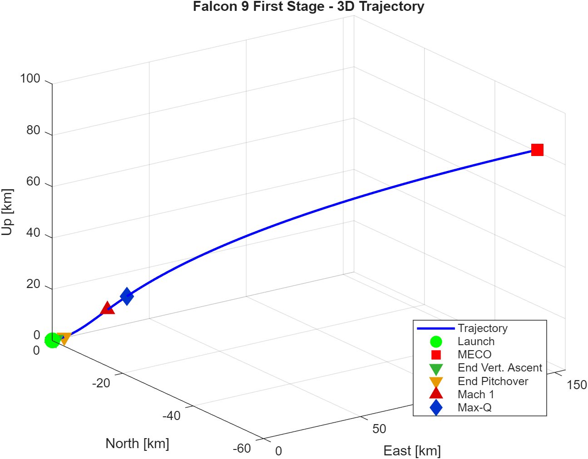
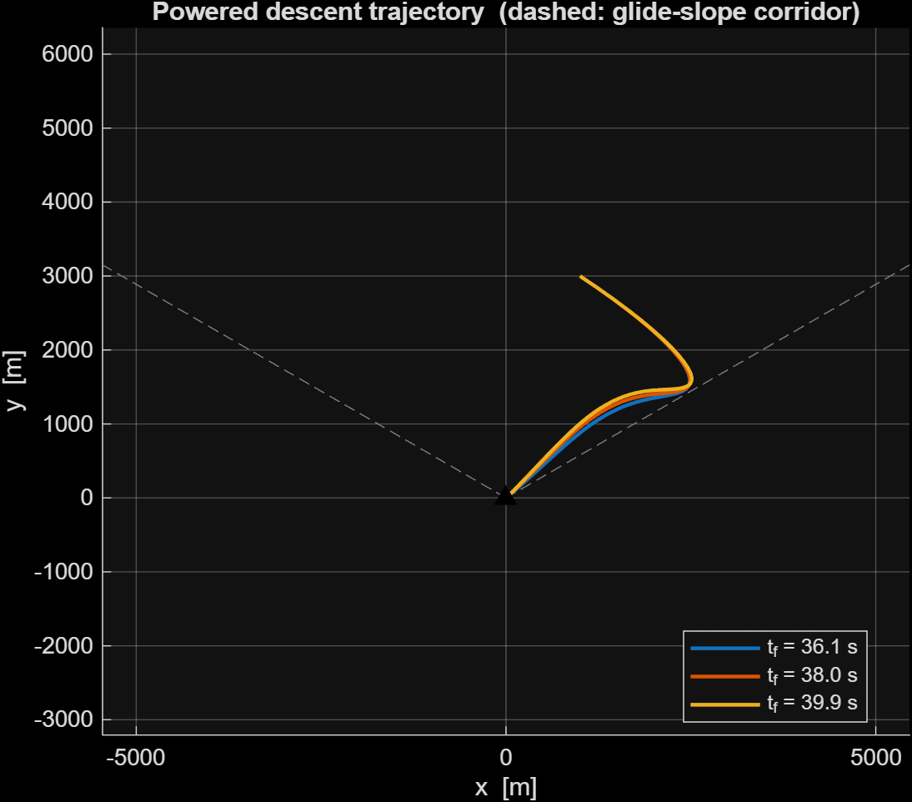

# Dynamics and Control of Launch Vehicles

> Graduate-course coursework, **Sapienza Università di Roma**, AA 2025/26
> (Prof. A. Zavoli). MATLAB implementations of trajectory-optimization,
> guidance, and control problems for launch vehicles — written as a public
> portfolio for **Guidance, Navigation & Control** engineering roles.

[](LICENSE)


---

## What's in here

Each folder is a self-contained homework with its own README, runnable MATLAB
entry-point, and figures regenerated on every run.

| #   | Topic                                            | Methods                                                                            | Folder |
| --- | ------------------------------------------------ | ---------------------------------------------------------------------------------- | ------ |
| HM0 | Falcon 9 first-stage 3-DoF ascent simulation     | Spherical-coords EOM, exponential atmosphere, three-phase mission program          | [HM0_falcon9_ascent/](HM0_falcon9_ascent/) |
| HM1 | Indirect optimization of a planar ascent (4 tasks)| Pontryagin Maximum Principle, single shooting BVP via `fsolve`, parameter continuation, coast-arc switching, optimal staging | [HM1/](HM1/) |
| HM2 | Reusable-LV powered descent and landing          | Direct collocation (trapezoidal), `fmincon`/SQP, convex glide-slope cone           | [HM2_powered_descent/](HM2_powered_descent/) |
| HM3 | Rigid-body LV control                            | *Planned* — H-infinity design, `systune`, sloshing, possibly Simulink              | — |

## Highlights

| HM0 — 3D ascent trajectory of the Falcon 9 first stage |
|:-:|
|  |
| Mach 1 at *t* ≈ 62 s, max-Q ≈ 29.5 kPa at *t* ≈ 75 s, MECO at 162 s. |

| HM1 — Final mass vs mass-flow rate, three target altitudes |
|:-:|
|  |
| Interior maximum of `m_f(Q)` exposes the gravity-loss vs acceleration-loss trade-off — solved by indirect shooting + parameter continuation. |

| HM2 — Powered-descent trajectories (sensitivity on `t_f` ± 5%) |
|:-:|
|  |
| Direct trapezoidal collocation; glide-slope corridor (dashed) handled as a convex linear pair. |

## What this demonstrates

- **Trajectory optimization end-to-end**: from formulation (cost,
  constraints, transversality) to numerical solution (single shooting,
  direct collocation) and post-processing (loss decomposition, sensitivity).
- **Both indirect and direct paradigms**: HM1 builds the costate equations
  by hand from the PMP; HM2 transcribes the OCP into a fmincon-friendly NLP.
  Knowing when each is appropriate is core GNC literacy.
- **Numerical robustness practices**: tight `ode45` tolerances, parameter
  **continuation** to keep shooting solvers in their basin of attraction,
  warm-starting between neighboring problems, sanity-checks on Hamiltonian
  vanishing.
- **Reproducibility**: every figure shown here is regenerated by running the
  corresponding script — no hand-edited plots, no external data.

## How to run

Requires MATLAB R2024b or newer. No external toolboxes for HM0 / HM1 /
HM2 Task 1; the **Optimization Toolbox** (for `fsolve` / `fmincon`) is the
only hard dependency.

```bash
# from the repo root
matlab -batch "cd HM0_falcon9_ascent; run('main.m')"
matlab -batch "cd HM1;                run('main_task1.m')"   % and 2,3,4
matlab -batch "cd HM2_powered_descent; run('main_task1.m')"
```

Each script writes its plots to a local `figures/` folder.

## Repository layout

```
DCLV/
├── HM0_falcon9_ascent/      Falcon 9 first-stage ascent simulation
├── HM1/                      Indirect optimization (4 tasks)
├── HM2_powered_descent/      Direct-collocation powered descent
├── tickets/                  Lightweight backlog (open / in-progress / done)
├── CLAUDE.md                 Project context & conventions for the AI maintainer
├── LICENSE                   MIT
└── README.md
```

The `tickets/` folder tracks ongoing work as plain-markdown items —
[`tickets/README.md`](tickets/README.md) describes the workflow.

## Status & roadmap

- ✅ HM0 — Falcon 9 first-stage 3-DoF ascent (done)
- ✅ HM1 — Indirect optimization, all four tasks (done)
- 🚧 HM2 — Task 1 (trapezoidal direct collocation) done. Task 2 (Zero-Order
       Hold transcription, ODE45 forward-validation) and SCvx variant
       pending.
- ⏳ HM3 — Rigid-body launch-vehicle control (H-∞, sloshing) — to be added
       later in the semester.

## Author

**Niccolò D'Ambrosio** — MSc Aerospace Engineering, Sapienza Università di
Roma. Targeting GNC engineering roles in launch / re-entry vehicles.

## License

Released under the [MIT License](LICENSE). Course-material PDFs (slides,
homework statements) are © Prof. A. Zavoli and are intentionally not
included in this repository.
