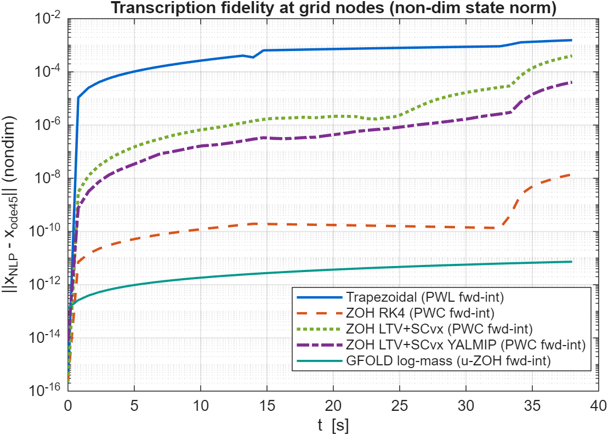

# Dynamics and Control of Launch Vehicles

> MATLAB coursework for the graduate course **Dynamics and Control of Launch
> Vehicles** (Prof. A. Zavoli, Sapienza Università di Roma, AA 2025/26):
> trajectory optimization, powered-descent guidance, and attitude control
> of launch vehicles.

[](LICENSE)


---

## What's in here

Each homework folder is self-contained: a local README (problem statement →
approach → results), runnable `main_*.m` entry points, figures regenerated on
every run, a class-based `matlab.unittest` suite, and — for HM1–HM3 — a
compiled LaTeX report.

| #   | Topic                                              | Methods                                                                     | Report |
| --- | -------------------------------------------------- | --------------------------------------------------------------------------- | ------ |
| [HM0](HM0_falcon9_ascent/) | Falcon 9 first-stage 3-DoF ascent simulation | Point-mass EOM in spherical coordinates, exponential atmosphere, vertical rise → pitchover → gravity turn; non-dimensional variant cross-validated by the test suite | — |
| [HM1](HM1/) | Indirect optimization of a planar ascent (4 tasks) | Pontryagin Maximum Principle, bilinear-tangent steering, single-shooting BVP (`ode45` + `fsolve`), parameter continuation, coast-arc switching, two-stage optimal staging with corner conditions | [PDF](HM1/report/main.pdf) |
| [HM2](HM2_powered_descent/) | Reusable-LV powered descent & pinpoint landing | Trapezoidal direct collocation (`fmincon`/SQP); four ZOH transcriptions — nonlinear + RK4 shooting, LTV + SCvx (fmincon and YALMIP+ECOS SOCP), GFOLD log-mass exact-LTI; KKT activity, grid convergence, `ode45` replay fidelity | [PDF](HM2_powered_descent/report/main.pdf) |
| [HM3](HM3/) | LV attitude control at max-q | Classical frequency-domain design on the Nichols chart: PD + drift feedback around an unstable airframe, bending-mode notch trade, TVC + transport delay, ±30% vertex robustness; Monte Carlo dispersion, LPV full-ascent gain scheduling, script-built Simulink models | [PDF](HM3/report/main.pdf) |

## Highlights

| HM0 — 3D ascent trajectory of the Falcon 9 first stage |
|:-:|
|  |
| Mach 1 at *t* ≈ 62 s, max-Q ≈ 29.5 kPa at *t* ≈ 75 s, MECO at 162 s (82.8 km, 2774 m/s). |

| HM1 — Final mass vs mass-flow rate, three target altitudes |
|:-:|
|  |
| Interior maximum of `m_f(Q)` exposes the gravity-loss vs steering-loss trade-off — solved by indirect shooting + parameter continuation (Q\* = 2.52 / 2.33 / 2.19). |

| HM2 — Transcription fidelity of five descent solutions |
|:-:|
|  |
| Max `ode45`-replay node error per method, spanning nine orders of magnitude: trapezoidal collocation (1.6·10⁻³) down to the GFOLD log-mass exact-LTI ZOH (7·10⁻¹², integrator floor, 3 SCvx iterations). |

| HM3 — Full-loop Nichols chart, deep notch + re-tuned PD |
|:-:|
|  |
| Conditionally stable loop around an open-loop-unstable airframe (pole at +1.84 rad/s): 6 dB aerodynamic gain margin, 30° rigid phase margin, bending lobe gain-stabilised 18 dB below 0 dB. |

## How to run

Requires MATLAB **R2024b or newer**. Toolbox dependencies:

- **Optimization Toolbox** (`fsolve` / `fmincon`) — HM1 and HM2;
- **Control System Toolbox** — HM3;
- optional: **YALMIP + ECOS** for the conic HM2 Task-2 variants
  (auto-skipped if absent — see [SETUP_YALMIP_ECOS.md](SETUP_YALMIP_ECOS.md)),
  **Simulink** for the HM3 closed-loop models, **Parallel Computing Toolbox**
  for the HM3 Monte Carlo (degrades to serial without it).

```bash
# from the repo root
matlab -batch "cd HM0_falcon9_ascent;  run('main.m')"
matlab -batch "cd HM1;                 run('main_task1.m')"    # ... main_task4.m
matlab -batch "cd HM2_powered_descent; run('main_task1.m')"    # main_task2.m
matlab -batch "cd HM3;                 run('main_task1.m')"    # main_task2/3.m, main_montecarlo.m
```

Each script writes its plots to a local `figures/` folder. Every homework
ships a test suite:

```bash
matlab -batch "runtests('HM1/tests')"   # same for HM0_falcon9_ascent, HM2_powered_descent, HM3
```

## Repository layout

```
DCLV/
├── HM0_falcon9_ascent/       Falcon 9 first-stage ascent simulation
├── HM1/                      Indirect optimization (4 tasks) + report
├── HM2_powered_descent/      Direct collocation + ZOH/SCvx variants + report
├── HM3/                      Attitude control at max-q + Monte Carlo + LPV + report
├── Report_template/          LaTeX skeleton shared by the reports
├── tickets/                  Lightweight backlog (open / in-progress / done)
├── LICENSE                   MIT
└── README.md
```

The `tickets/` folder tracks ongoing work as plain-markdown items —
[`tickets/README.md`](tickets/README.md) describes the workflow.

## Status

- ✅ HM0 — Falcon 9 first-stage 3-DoF ascent
- ✅ HM1 — Indirect optimization, all four tasks + report
- ✅ HM2 — Task 1 (direct collocation) and Task 2 (four ZOH transcriptions,
       incl. SCvx and GFOLD log-mass) + report
- ✅ HM3 — Tasks 1–3 (Nichols design, bending notch, parametric robustness)
       + Monte Carlo, LPV full-ascent extension, Simulink reproduction + report
- 🔭 Open extension ([T006](tickets/open/T006_hm2-lossless-socp.md)):
       lossless-convexification single-SOCP variant of HM2.

## Author

**Niccolò D'Ambrosio** — MSc Aerospace Engineering, Sapienza Università di
Roma.

## License

Released under the [MIT License](LICENSE). Course-material PDFs (slides,
homework statements) are © Prof. A. Zavoli and are intentionally not
included in this repository.
